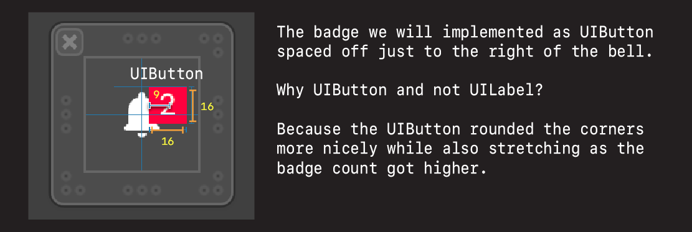
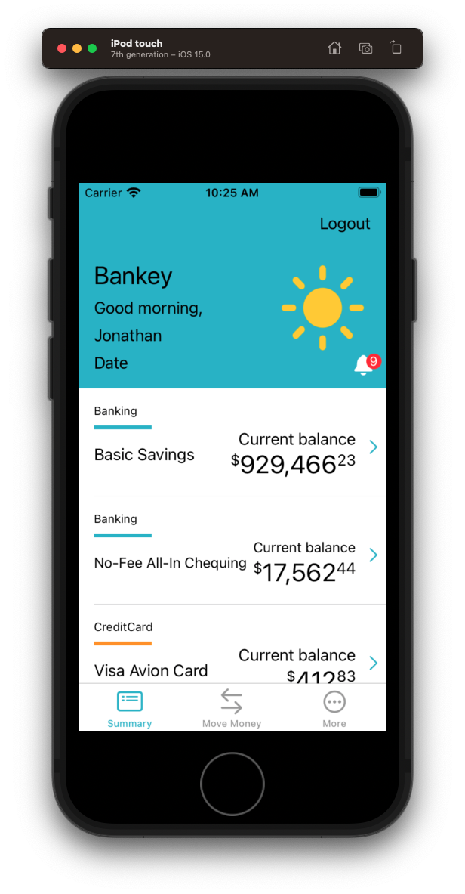

# Animating with Core Animation

## Overview

- What is Core Animation?
- How does it work?
- How can we use it in our apps

Things to go through:

- [Core Graphics](https://github.com/jrasmusson/swift-arcade/blob/master/Animation/CoreGraphicsIntro/README.md)
- [Core Animation Intro](https://github.com/jrasmusson/swift-arcade/blob/master/Animation/CoreAnimation/Intro/README.md)
- [Apple Core Animation Docs](https://developer.apple.com/library/archive/documentation/Cocoa/Conceptual/CoreAnimation_guide/CoreAnimationBasics/CoreAnimationBasics.html#//apple_ref/doc/uid/TP40004514-CH2-SW3)
- [Animatable properties](https://developer.apple.com/library/archive/documentation/Cocoa/Conceptual/CoreAnimation_guide/AnimatableProperties/AnimatableProperties.html)

While you can go deep with Core Animation, you don't have to become an expert it to do useful things.

Let's know go back to our project and see how we can bright things up by adding some cool Core Animations to our project.


## Shaking the login button

Let's make it so that when the user enters an incorrect password, the login button shakes.

Set our username and password.

**LoginViewController**

```swift
// Check for blanks
if username.isEmpty || password.isEmpty {
    configureView(withMessage: "Username / password cannot be blank")
    return
}
    
if username == "Flynn" && password == "Welcome" {
    signInButton.configuration?.showsActivityIndicator = true
    delegate?.didLogin()
} else {
    configureView(withMessage: "Incorrect username / password")
}
```

Run the app. Error message if password wrong.

Let's animate things by shaking the sign in button showing login failed.


**LoginViewController**

```swift
private func configureView(withMessage message: String) {
    errorMessageLabel.isHidden = false
    errorMessageLabel.text = message
    shakeButton()
}
    
private func shakeButton() {
    let animation = CAKeyframeAnimation()
    animation.keyPath = "position.x"
    animation.values = [0, 10, -10, 10, 0]
    animation.keyTimes = [0, 0.16, 0.5, 0.83, 1]
    animation.duration = 0.4

    animation.isAdditive = true
    signInButton.layer.add(animation, forKey: "shake")
}
```

Save your work

```
> git add .
> git commit -m "feat: Shake signin button if login fails"
```

## Shakey Bell

Now that's just one small simple but powerful example of what Core Animation can do. Let's now look at a more advanced example, and see if we can't add shakey bell.

- Demo shakey bell.
- Explain the mechanics behind how it works.
 - Programmatically going to build a custom view
 - Going to add the shake animation in there
 - Display in our header view  

### Create the bell


- Create a new dir called `Components`.
- Create a new view called `ShakeyBellView`

**ShakeyBellView**

```swift
import Foundation
import UIKit

class ShakeyBellView: UIView {
    
    let imageView = UIImageView()
    
    override init(frame: CGRect) {
        super.init(frame: frame)
        style()
        layout()
    }
    
    required init?(coder: NSCoder) {
        fatalError("init(coder:) has not been implemented")
    }
    
    override var intrinsicContentSize: CGSize {
        return CGSize(width: 48, height: 48)
    }
}

extension ShakeyBellView {
    
    func style() {
        translatesAutoresizingMaskIntoConstraints = false
        imageView.translatesAutoresizingMaskIntoConstraints = false
        let image = UIImage(systemName: "bell.fill")!.withTintColor(.white, renderingMode: .alwaysOriginal)
        imageView.image = image
    }
    
    func layout() {
        addSubview(imageView)
        
        NSLayoutConstraint.activate([
            imageView.centerXAnchor.constraint(equalTo: centerXAnchor),
            imageView.centerYAnchor.constraint(equalTo: centerYAnchor),
            imageView.heightAnchor.constraint(equalToConstant: 24),
            imageView.widthAnchor.constraint(equalToConstant: 24)
        ])
    }
}
```

### Add it to the table view header

Because we are in a table view, and because the header is right at the top, to include our shakey bell in the table we need to add it to the header.

**AccountSummaryHeaderView**

```swift
let shakeyBellView = ShakeyBellView()
```

And then adding it to our view and doing Auto Layout just like any other control.

```swift
private func commonInit() {
        setupShakeyBell()
    }
    
    private func setupShakeyBell() {
        shakeyBellView.translatesAutoresizingMaskIntoConstraints = false
        addSubview(shakeyBellView)
        
        NSLayoutConstraint.activate([
            shakeyBellView.trailingAnchor.constraint(equalTo: trailingAnchor),
            shakeyBellView.bottomAnchor.constraint(equalTo: bottomAnchor)
        ])
    }
}
```


### Making it tappable

It would be nice if it was tappable for testing. 

**ShakeyBellView**

```swift
override init(frame: CGRect) {
    super.init(frame: frame)
    setup()
}

extension ShakeyBellView {
    
    func setup() {
        let singleTap = UITapGestureRecognizer(target: self, action: #selector(imageViewTapped(_: )))
        imageView.addGestureRecognizer(singleTap)
        imageView.isUserInteractionEnabled = true
    }
}

// MARK: - Actions
extension ShakeyBellView {
    @objc func imageViewTapped(_ recognizer: UITapGestureRecognizer) {
        // insert animation here...
        print("Shaking!!!")
    }
}
```

If we run, we'll just see a print statement for now. But that's OK. Now we are ready to talk animation.

### Animating it in a test rig

Let's first review how the animation works, and then I will show you one nice technique for getting the animation you want.

- [How it works](https://github.com/jrasmusson/swift-arcade/blob/master/Animation/ShakeyBell/README.md)
- Demo the test rig


### Adding the animation to the view

So now that we understand how the animation works, let's add it to our view.

**ShakeyBellView**

```swift
// MARK: - Actions
extension ShakeyBellView {
    @objc func imageViewTapped(_ recognizer: UITapGestureRecognizer) {
        shakeWith(duration: 1.0, angle: .pi/8, yOffset: 0.0)
    }

    private func shakeWith(duration: Double, angle: CGFloat, yOffset: CGFloat) {
        let numberOfFrames: Double = 6
        let frameDuration = Double(1/numberOfFrames)
        
        imageView.setAnchorPoint(CGPoint(x: 0.5, y: yOffset))

        UIView.animateKeyframes(withDuration: duration, delay: 0, options: [],
          animations: {
            UIView.addKeyframe(withRelativeStartTime: 0.0,
                               relativeDuration: frameDuration) {
                self.imageView.transform = CGAffineTransform(rotationAngle: -angle)
            }
            UIView.addKeyframe(withRelativeStartTime: frameDuration,
                               relativeDuration: frameDuration) {
                self.imageView.transform = CGAffineTransform(rotationAngle: +angle)
            }
            UIView.addKeyframe(withRelativeStartTime: frameDuration*2,
                               relativeDuration: frameDuration) {
                self.imageView.transform = CGAffineTransform(rotationAngle: -angle)
            }
            UIView.addKeyframe(withRelativeStartTime: frameDuration*3,
                               relativeDuration: frameDuration) {
                self.imageView.transform = CGAffineTransform(rotationAngle: +angle)
            }
            UIView.addKeyframe(withRelativeStartTime: frameDuration*4,
                               relativeDuration: frameDuration) {
                self.imageView.transform = CGAffineTransform(rotationAngle: -angle)
            }
            UIView.addKeyframe(withRelativeStartTime: frameDuration*5,
                               relativeDuration: frameDuration) {
                self.imageView.transform = CGAffineTransform.identity
            }
          },
          completion: nil
        )
    }
}

// https://www.hackingwithswift.com/example-code/calayer/how-to-change-a-views-anchor-point-without-moving-it
extension UIView {
    func setAnchorPoint(_ point: CGPoint) {
        var newPoint = CGPoint(x: bounds.size.width * point.x, y: bounds.size.height * point.y)
        var oldPoint = CGPoint(x: bounds.size.width * layer.anchorPoint.x, y: bounds.size.height * layer.anchorPoint.y)

        newPoint = newPoint.applying(transform)
        oldPoint = oldPoint.applying(transform)

        var position = layer.position

        position.x -= oldPoint.x
        position.x += newPoint.x

        position.y -= oldPoint.y
        position.y += newPoint.y

        layer.position = position
        layer.anchorPoint = point
    }
}
```

Yay 🎉. Cool animation added.

Save your work

```
> git add .
> git commit -m "feat: Shake the bell"
```


### Adding a badge

Let's make one more adjustment to our cool shakey animation bell. Let's add a badge.



**ShakeyBellView**

```swift
let buttonView = UIButton()

let buttonHeight: CGFloat = 16

func style() {
            
    buttonView.translatesAutoresizingMaskIntoConstraints = false
    buttonView.backgroundColor = .systemRed
    buttonView.titleLabel?.font = UIFont.systemFont(ofSize: 13)
    buttonView.layer.cornerRadius = buttonHeight/2
    buttonView.setTitle("9", for: .normal)
    buttonView.setTitleColor(.white, for: .normal)
}

func layout() {
    addSubview(imageView)
    addSubview(buttonView)

    // Button
    NSLayoutConstraint.activate([
        buttonView.topAnchor.constraint(equalTo: imageView.topAnchor),
        buttonView.leadingAnchor.constraint(equalTo: imageView.trailingAnchor, constant: -9),
        buttonView.widthAnchor.constraint(equalToConstant: 16),
        buttonView.heightAnchor.constraint(equalToConstant: 16)
    ])
}
```

Discussion:

- why the hard coded font size of 13
- point out the corner radius
- limitation is only one digit
- hard coding to white



Save your work

```
> git add .
> git commit -m "feat: Adding the badge"
```


### Links that help

- [Intro to Core Graphics](https://github.com/jrasmusson/swift-arcade/blob/master/Animation/CoreGraphicsIntro/README.md)
- [Intro to Core Animation](https://github.com/jrasmusson/swift-arcade/blob/master/Animation/CoreAnimation/Intro/README.md)

