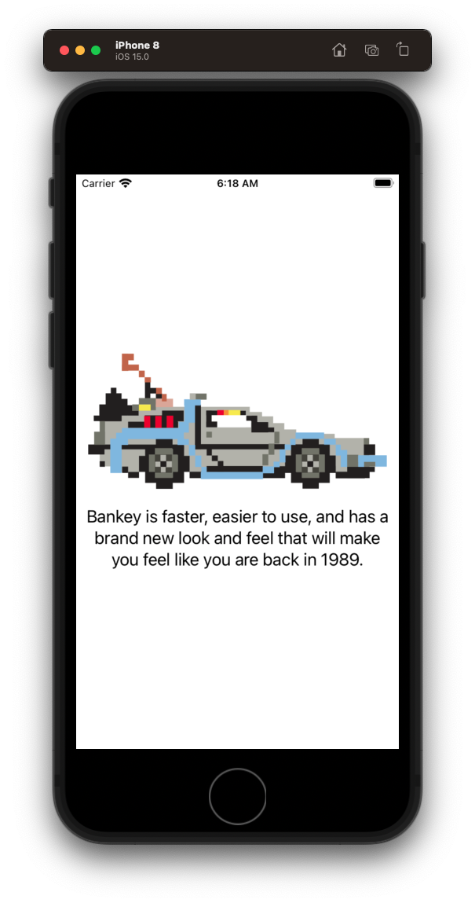
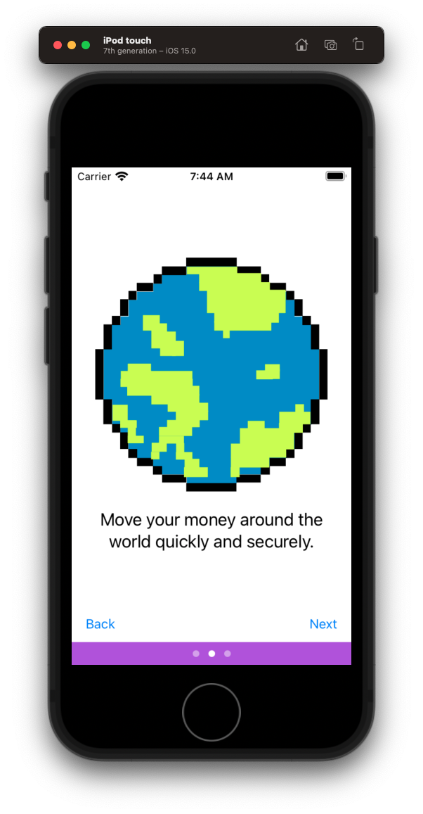

# Onboarding

## Setup

### Agile storyboard

- Introduce [Agile story board](https://trello.com/b/vU5ETuV5/ios-professional)
- Explain mechanics of how it works with stories
- Mention Jira
- Go over story
- Move over story

## Create Container View Controller

- Explain how `UIPageViewController` works
 - Illustrator or iPad 
- Create a new group in project `Onboarding`
- Move Files to bottom
- Rename LoginView Login
- Create a new `OnboardingContainerViewController`
- Copy and paste in code incrementally explaining as you go
- Switch to dark mode

**OnboardingContainerViewController**

```swift
//
//  OnboardingContainerViewController.swift
//  Bankey
//
//  Created by jrasmusson on 2021-09-28.
//

import UIKit

class OnboardingContainerViewController: UIViewController {

    let pageViewController: UIPageViewController
    var pages = [UIViewController]()
    var currentVC: UIViewController {
        didSet {
        }
    }
    
    override init(nibName nibNameOrNil: String?, bundle nibBundleOrNil: Bundle?) {
        self.pageViewController = UIPageViewController(transitionStyle: .scroll, navigationOrientation: .horizontal, options: nil)
        
        let page1 = ViewController1()
        let page2 = ViewController2()
        let page3 = ViewController3()
        
        self.pages.append(page1)
        self.pages.append(page2)
        self.pages.append(page3)
        
        self.currentVC = pages.first!
        
        super.init(nibName: nibNameOrNil, bundle: nibBundleOrNil)
    }
    
    required init?(coder: NSCoder) {
        fatalError("init(coder:) has not been implemented")
    }
    
    override func viewDidLoad() {
        super.viewDidLoad()
        
        view.backgroundColor = .systemPurple
        
        addChild(pageViewController)
        view.addSubview(pageViewController.view)
        pageViewController.didMove(toParent: self)
        
        pageViewController.dataSource = self
        pageViewController.view.translatesAutoresizingMaskIntoConstraints = false
        
        NSLayoutConstraint.activate([
            view.topAnchor.constraint(equalTo: pageViewController.view.topAnchor),
            view.leadingAnchor.constraint(equalTo: pageViewController.view.leadingAnchor),
            view.trailingAnchor.constraint(equalTo: pageViewController.view.trailingAnchor),
            view.bottomAnchor.constraint(equalTo: pageViewController.view.bottomAnchor),
        ])
        
        pageViewController.setViewControllers([pages.first!], direction: .forward, animated: false, completion: nil)
        currentVC = pages.first!
    }
}

// MARK: - UIPageViewControllerDataSource
extension OnboardingContainerViewController: UIPageViewControllerDataSource {

    func pageViewController(_ pageViewController: UIPageViewController, viewControllerBefore viewController: UIViewController) -> UIViewController? {
        return getPreviousViewController(from: viewController)
    }

    func pageViewController(_ pageViewController: UIPageViewController, viewControllerAfter viewController: UIViewController) -> UIViewController? {
        return getNextViewController(from: viewController)
    }

    private func getPreviousViewController(from viewController: UIViewController) -> UIViewController? {
        guard let index = pages.firstIndex(of: viewController), index - 1 >= 0 else { return nil }
        currentVC = pages[index - 1]
        return pages[index - 1]
    }

    private func getNextViewController(from viewController: UIViewController) -> UIViewController? {
        guard let index = pages.firstIndex(of: viewController), index + 1 < pages.count else { return nil }
        currentVC = pages[index + 1]
        return pages[index + 1]
    }

    func presentationCount(for pageViewController: UIPageViewController) -> Int {
        return pages.count
    }

    func presentationIndex(for pageViewController: UIPageViewController) -> Int {
        return pages.firstIndex(of: self.currentVC) ?? 0
    }
}

// MARK: - ViewControllers
class ViewController1: UIViewController {
    override func viewDidLoad() {
        super.viewDidLoad()
        view.backgroundColor = .systemRed
    }
}

class ViewController2: UIViewController {
    override func viewDidLoad() {
        super.viewDidLoad()
        view.backgroundColor = .systemGreen
    }
}

class ViewController3: UIViewController {
    override func viewDidLoad() {
        super.viewDidLoad()
        view.backgroundColor = .systemBlue
    }
}
```

Update `AppDelegate` to call.

**AppDelegate**

```swift
window?.rootViewController = OnboardingViewController()
```

- Git add/commit your work `Added onboarding view controller`

## Not all art is created equal

- Drag art assets into catalog
- Show how to use pdf
 - Preserve Vector Data
 - Scales > Single Scale
 
### Discusson

- Explain pdf vs retina display
  - pdf scale better
  - take less memory and space
  - don't alias like an image 
  - reason why is vectors and their pdf representation can compactly be represented as a series of equations and numbers

- Why Apple has retina
 - need retina for photographs
 - photographs cant be easily represented as equations 

- So unless the image you are displaying is a photograph always ask for pdfs - else take scaled retina images

## Your first onboarding screen

- Explain your thinking behind this layout
 - Want centered in screen
 - `StackView` is good for general spacing
 - Want to avoid hard pinning to top
 - Control and buttons can be directly pinned
 - But image and label we will put in a stack

 **OnboardingViewController1**
 
```swift
//
//  OnboardingViewController1.swift
//  Bankey
//
//  Created by jrasmusson on 2021-09-29.
//

import UIKit

class OnboardingViewController1: UIViewController {
    
    let stackView = UIStackView()
    let imageView = UIImageView()
    let label = UILabel()
    
    override func viewDidLoad() {
        super.viewDidLoad()
        style()
        layout()
    }
}

extension OnboardingViewController1 {
    func style() {
        stackView.translatesAutoresizingMaskIntoConstraints = false
        stackView.axis = .vertical
        stackView.spacing = 20
        
        // Image
        imageView.translatesAutoresizingMaskIntoConstraints = false
        imageView.contentMode = .scaleAspectFit
        imageView.image = UIImage(named: "delorean")
        
        // Label
        label.translatesAutoresizingMaskIntoConstraints = false
        label.textAlignment = .center
        label.font = UIFont.preferredFont(forTextStyle: .title3)
        label.adjustsFontForContentSizeCategory = true
        label.numberOfLines = 0
        label.text = "Bankey is faster, easier to use, and has a brand new look and feel that will make you feel like you are back in 1989."
    }
    
    func layout() {
        stackView.addArrangedSubview(imageView)
        stackView.addArrangedSubview(label)
        
        view.addSubview(stackView)
        
        NSLayoutConstraint.activate([
            stackView.centerXAnchor.constraint(equalTo: view.centerXAnchor),
            stackView.centerYAnchor.constraint(equalTo: view.centerYAnchor),
            stackView.leadingAnchor.constraint(equalToSystemSpacingAfter: view.leadingAnchor, multiplier: 1),
            view.trailingAnchor.constraint(equalToSystemSpacingAfter: stackView.trailingAnchor, multiplier: 1)
        ])
    }
}
```

- Adjust `AppDelegate` to display.
- Explain why overriding view controller in app delegate is such a powerful technique



- Save your work - `First onboarding page`.

 ### Boss Challenge
 
- Your turn. Create the next screen.
- Create a new view controller called `OnboardingViewController2`.
- Use the `world` pdf as art
- Add the text `Move your money around the world quickly and securely.`
- Update the `AppDelegate` to test it out.
- Good luck!

Solution 
- Copy and paste view controller 1
- Change image, and text.
- Run


- Save your work - `Added second onboarding page`.

## Refactoring - the art of writing less code

- Copy and paste is a perfectly fine way to get started, but we don't want to do it too much because then we have a lot of code to update when something changes
- Let's see if we can refactor our view controllers to put all this onboarding code in one place, and reuse it three times

### Create reusable view controller

- Create a new swift class `OnboardingViewController`.
- Copy view controller 1 entirely / rename
- Explain how you want to parameterize this view controller
- Meaning pass in the name of the image and text you want displayed, and then have this base view controller just use it

### What is required init?

```swift
init(heroImageName: String, titleText: String) {
    self.heroImageName = heroImageName
    self.titleText = titleText
    
    super.init(nibName: nil, bundle: nil)
}
```

Explain 

```swift
required init?(coder: NSCoder) {
    fatalError("init(coder:) has not been implemented")
}
```

- This is here because `UIViewController` has an initializer defined in its base class to deserialize view controllers in story boars

```swift
init(coder aDecoder: NSCoder) {
    // Deserialize your object here
}
```

- Because it defines it, and it is required, we need to override it here - even though we aren't using it.
- Annoying but something we have to do.
- It has been there since the dawn of time. Something we just need to do.
- Ask them if they know what NS means? [Interface Builder](https://arstechnica.com/gadgets/2012/12/the-legacy-of-next-lives-on-in-os-x/2/).

```swift
@available(iOS 2.0, *)
open class UIViewController : UIResponder, NSCoding, UIAppearanceContainer, UITraitEnvironment, UIContentContainer, UIFocusEnvironment {
    public init(nibName nibNameOrNil: String?, bundle nibBundleOrNil: Bundle?)
    public init?(coder: NSCoder)
```

Use the parameters

- `heroImageView.image = UIImage(named: heroImageName)`
- `titleLabel.text = titleText`

Use the new view controller

**OnboardingContainerViewController**

```swift
let page1 = OnboardingViewController(heroImageName: "delorean", titleText: "Bankey is faster, easier to use, and has a brand new look and feel that will make you feel like you are back in the 80s.")
let page2 = OnboardingViewController(heroImageName: "world", titleText: "Move your money around the world quickly and securely.")
let page3 = OnboardingViewController(heroImageName: "thumbs", titleText: "Learn more at www.bankey.com.")
```

- Update AppDelegate.
- Run
- Delete onboard 1 and 2 view controllers

#### Saving your work with a longer commit message

Sometimes we want to say more about our commits. In those cases you can do the following:

```
> git add .
> git commit
```

This will open up vi, or whatever text edit you have automatically setup to edit text files, and put you into a mode where you can freely type free form git message.

Start with a title and then add a message. For the title use imperative language - not painting the fence, or painted the fence. Paint the fense.

Completes the sentence `This commit will...`.

```
refactor: create generic onboarding view controller

This commit adds a generic onboarding view controller that can be reused
across multiple onboarding screens. 
```

Once complete esc :wq.

`> git log`

Handy for when you want to add explain yourself more or add further detail.


## Adding the buttons

### Next button

We want:

- `Close` on all x3 screens
- `Next` and `Back` on the middle screen
- `Done` on last screen


Open up and lets programmatically add the buttons one at a time. Starting with `Next` and `Back`.

First lets do a little refactoring and break these methods up a bit in `viewDidLoad`:

- setup()
- style()
- layout()

**OnboardingContainerViewController**

```swift
let nextButton = UIButton(type: .system)

nextButton.translatesAutoresizingMaskIntoConstraints = false
nextButton.setTitle("Next", for: [])
nextButton.addTarget(self, action: #selector(nextTapped), for: .primaryActionTriggered)

view.addSubview(nextButton)

// Next
NSLayoutConstraint.activate([
    view.trailingAnchor.constraint(equalToSystemSpacingAfter: nextButton.trailingAnchor, multiplier: 2),
    view.bottomAnchor.constraint(equalToSystemSpacingBelow: nextButton.bottomAnchor, multiplier: 4)
])

// MARK: Actions
extension OnboardingContainerViewController {
    @objc func nextTapped(_ sender: UIButton) {
        guard let nextVC = getNextViewController(from: currentVC) else { return }
        pageViewController.setViewControllers([nextVC], direction: .forward, animated: true, completion: nil)
    }
}
```

Then let's hide `next` on the last page. Can do this in `didSet`.

```swift
didSet {
    guard let index = pages.firstIndex(of: currentVC) else { return }
    nextButton.isHidden = index == pages.count - 1
}
```

Save our work `Add a next button to onboarding`.

### Back button challenge

Let's get you in the game. See if you can add the back button.

- Position like next only on left hand side
- When tapped make it go to the previous page
- Hide if on the first page

Good luck!

```swift
let backButton = UIButton(type: .system)

backButton.translatesAutoresizingMaskIntoConstraints = false
backButton.setTitle("Back", for: [])
backButton.addTarget(self, action: #selector(backTapped), for: .primaryActionTriggered)

view.addSubview(backButton)

// Back
NSLayoutConstraint.activate([
    backButton.leadingAnchor.constraint(equalToSystemSpacingAfter: view.leadingAnchor, multiplier: 2),
    view.bottomAnchor.constraint(equalToSystemSpacingBelow: backButton.bottomAnchor, multiplier: 4)
])

@objc func backTapped(_ sender: UIButton) {
    guard let previousVC = getPreviousViewController(from: currentVC) else { return }
    pageViewController.setViewControllers([previousVC], direction: .reverse, animated: true, completion: nil)
}

backButton.isHidden = index == 0 // hide if on last page
```



#### Close and Done buttons

Close and Done are just like the others. Close appears always. Done only when we are on the last page.

First let's do close.

```swift
let closeButton = UIButton(type: .system)

closeButton.translatesAutoresizingMaskIntoConstraints = false
closeButton.setTitle("Close", for: [])
closeButton.addTarget(self, action: #selector(closeTapped), for: .primaryActionTriggered)

view.addSubview(closeButton)

// Close
NSLayoutConstraint.activate([
    closeButton.leadingAnchor.constraint(equalToSystemSpacingAfter: view.leadingAnchor, multiplier: 2),
    closeButton.topAnchor.constraint(equalToSystemSpacingBelow: view.safeAreaLayoutGuide.topAnchor, multiplier: 2)
])

@objc func closeTapped(_ sender: UIButton) {
    // TODO
}
```

Then let's add Done.

```swift
let doneButton = UIButton(type: .system)

doneButton.translatesAutoresizingMaskIntoConstraints = false
doneButton.setTitle("Done", for: [])
doneButton.addTarget(self, action: #selector(doneTapped), for: .primaryActionTriggered)

view.addSubview(doneButton)

// Done
NSLayoutConstraint.activate([
    view.trailingAnchor.constraint(equalToSystemSpacingAfter: doneButton.trailingAnchor, multiplier: 2),
    view.bottomAnchor.constraint(equalToSystemSpacingBelow: doneButton.bottomAnchor, multiplier: 4)
])

@objc func doneTapped(_ sender: UIButton) {
    // TODO
}

doneButton.isHidden = !(index == pages.count - 1) // show if on last page
```

Don't worry about Close and Done not doing anything. We will handle that in the next section.

## Protocol Delegate

Before we can go any further, we need a way of signally back to our `AppDelegate` when certain events in our app occur. For example it would be nice to know when the user has clicked `Signin` so we can present onboarding. Or when the click `Close` on onboarding, that's a signal for us to continue and move them onto the next stage in our app.

There are lots of ways we could solve this problem (`NotificationCenter`, `ResponderChain`, `Closures`). But the simplest, and most elegant and in my opinion `UIKit` consist way is to communicate back via the `protocol-delegate` pattern.

Let's quickly review this pattern. See how it works. And then apply it to our login screen and onboarding process. See you in the next section!

## New section called Protocol-Delegate

### Explain how protocol delegate works

### Show how we want to use it in our app

### Add protocol delegate to login

### User it in app delegate to display onboarding

### Challenge - get students to add to onboarding for close button

### Use it to display a temporary DummyView

## Onboard only once

## Turn off onboarding via debug screen

### Level Up


