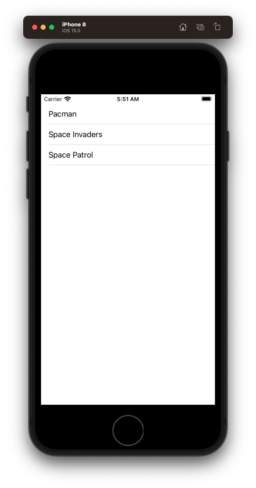
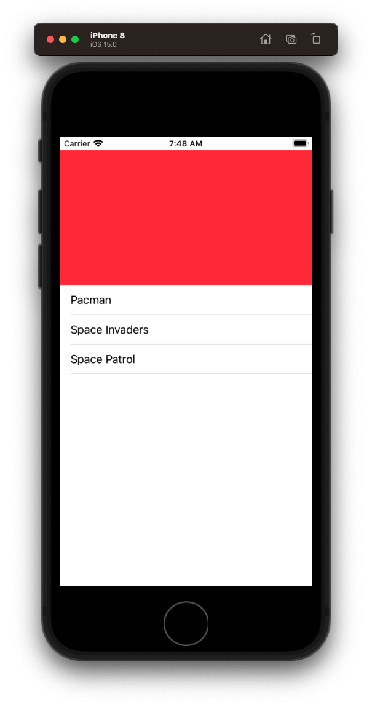
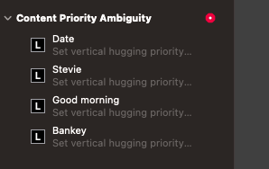
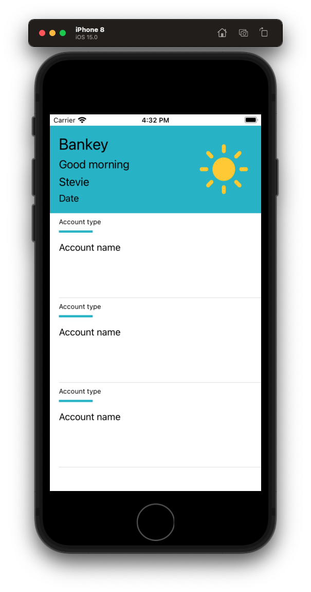

# Account Summary

- image of app navigation


## Discussion of which control to use

### ScrollView

- good for static fixed views
- not good if your data needs to reload

### CollectionView

- good
- little more complex
- sometimes overkill

### TableView

- the work horse of UIKit
- can do just about anything
- will use later

We are going to go with `UITableView`. 

- Its the most commonly used control out there.
- It can do everything you'll ever need.


## Setup

- create branch `account-summary`.
- explain what branches are how they work

## Account Summary View Controller

- demo the page
- explain how it is laid out
- demo some of they affordances (collapable title)
- start building it

## Adding the tab bar

**MainViewController**

```swift
import UIKit

class MainViewController: UITabBarController {

    override func viewDidLoad() {
        super.viewDidLoad()
        setupViews()
    }

    func setupViews() {
        let summaryVC = AccountSummaryViewController()
        summaryVC.setTabBarImage(imageName: "list.dash.header.rectangle", title: "Summary")

        let moveMoneyVC = MoveMoneyViewController()
        moveMoneyVC.setTabBarImage(imageName: "arrow.left.arrow.right", title: "Move Money")

        let moreVC = MoreViewController()
        moreVC.setTabBarImage(imageName: "ellipsis.circle", title: "More")

        let tabBarList = [summaryVC, moveMoneyVC, moreVC]

        viewControllers = tabBarList
    }
}

class AccountSummaryViewController: UIViewController {
    override func viewDidLoad() {
        view.backgroundColor = .systemGray6
    }
}

class MoveMoneyViewController: UIViewController {
    override func viewDidLoad() {
        view.backgroundColor = .systemGray5
    }
}

class MoreViewController: UIViewController {
    override func viewDidLoad() {
        view.backgroundColor = .systemGray4
    }
}

extension UIViewController {
    func setTabBarImage(imageName: String, title: String) {
        let configuration = UIImage.SymbolConfiguration(scale: .large)
        let image = UIImage(systemName: imageName, withConfiguration: configuration)
        tabBarItem = UITabBarItem(title: title, image: image, tag: 0)
    }
}
```

Delete `DummyViewController`. Add `MainViewController`.

**AppDelegate**

```swift
let mainViewController = MainViewController()
setRootViewController(mainViewController) // x2
```

## Creating Account Summary View Controller

- UITableView with custom cell and header
- Create directory `AccountSummary`
- Extract into own class


Let's start with an empty table view controller with some basic data.

**AccountSummaryViewController**

```swift
import UIKit

class AccountSummaryViewController: UIViewController {
    
    let games = [
        "Pacman",
        "Space Invaders",
        "Space Patrol",
    ]
    
    var tableView = UITableView()
    
    override func viewDidLoad() {
        super.viewDidLoad()
        setup()
    }
}

extension AccountSummaryViewController {
    private func setup() {
        setupTableView()
    }
    
    private func setupTableView() {
        tableView.delegate = self
        tableView.dataSource = self
        
        view = tableView
    }
}

extension AccountSummaryViewController: UITableViewDataSource {
    func tableView(_ tableView: UITableView, cellForRowAt indexPath: IndexPath) -> UITableViewCell {
        let cell = UITableViewCell()
        cell.textLabel?.text = games[indexPath.row]
        return cell
    }
    
    func tableView(_ tableView: UITableView, numberOfRowsInSection section: Int) -> Int {
        return games.count
    }
}

extension AccountSummaryViewController: UITableViewDelegate {
    func tableView(_ tableView: UITableView, didSelectRowAt indexPath: IndexPath) {
        
    }
}
```

Discussion:

- simplest table we can start with
- explain how table layout is done here
- remind people how table view works



Next let's add the header.

### Adding the table view header

- There is lots of confusion around how to add a table view header ([link](https://stackoverflow.com/questions/16471846/is-it-possible-to-use-autolayout-with-uitableviews-tableheaderview))
- The simplest, most reliable way is to create a complex, autolayout header is to:
 - Create a nib 
 - Add it as a `tableHeaderView` to the table.

#### Create a class

- Create a class `AccountSummaryHeaderView`

**AccountSummaryHeaderView**

```swift
import UIKit

class AccountSummaryHeaderView: UIView {

}
```

#### Create a nib

- Create a nib view named `AccountSummaryHeaderView`
- Set to height `200`
- Set `File's Owner` to `AccountSummaryHeaderView`
- Give the nib a red background
- Drag `view` from nib into file and call `contentView`.
- Then load the nib and pin to the edges like this
 
**AccountSummaryHeaderView**

```swift
import UIKit

class AccountSummaryHeaderView: UIView {
    
    @IBOutlet var contentView: UIView!
    
    override init(frame: CGRect) {
        super.init(frame: frame)
        commonInit()
    }
    
    required init?(coder aDecoder: NSCoder) {
        super.init(coder: aDecoder)
        commonInit()
    }
    
    override var intrinsicContentSize: CGSize {
        return CGSize(width: UIView.noIntrinsicMetric, height: 144)
    }
    
    private func commonInit() {
        let bundle = Bundle(for: AccountSummaryHeaderView.self)
        bundle.loadNibNamed("AccountSummaryHeaderView", owner: self, options: nil)
        addSubview(contentView)
        
        contentView.translatesAutoresizingMaskIntoConstraints = false
        contentView.topAnchor.constraint(equalTo: self.topAnchor).isActive = true
        contentView.rightAnchor.constraint(equalTo: self.rightAnchor).isActive = true
        contentView.bottomAnchor.constraint(equalTo: self.bottomAnchor).isActive = true
        contentView.leftAnchor.constraint(equalTo: self.leftAnchor).isActive = true
    }
}
```

- Add it to the table.


```swift
setupTableHeaderView()

private func setupTableHeaderView() {
    let header = AccountSummaryHeaderView(frame: .zero)
    
    var size = header.systemLayoutSizeFitting(UIView.layoutFittingCompressedSize)
    size.width = UIScreen.main.bounds.width
    header.frame.size = size
    
    tableView.tableHeaderView = header
}        
```



### Styling the header

- Now because we have a nib, we can do all our auto layout in there.
- Set background back to `System Background Color`.

Drag out the following and embed in a stack view.

- `logoLabel` - title1, Bankey
- `greetingLabel` - title3, Good morning, 
- `nameLabel` - title3 bold, Jonathan
- `dateLablel` - body

Explain what CHCR means and how to fix.



Bankey.


Drag out an imageView and set to `sun.max.fill`. 

- Embed the label stackview and image in another stack view.
- Set `View` background to `teal`.

Layout as follows:


Should now look like this.


Header looking good. Next let's define a cell for our table view.

Bonus video: Give a demo of Reveal and how to use when checking your layouts for ambiguity.

Save your work.

## Creating the customer table view cell

- Explain what table view cells are
- How they work
- Why iOS is able to scroll so quickly and be so efficient

While we could do this with a nib, let's do this one entirely programmatically so you can see how that would work.

Create a new class in Account Summary called `AccountSummaryCell`.

**AccountSummaryCell**

```swift
import Foundation
import UIKit

class AccountSummaryCell: UITableViewCell {
    
    override init(style: UITableViewCell.CellStyle, reuseIdentifier: String?) {
        super.init(style: style, reuseIdentifier: reuseIdentifier)
        setup()
        layout()
    }
    
    required init?(coder aDecoder: NSCoder) {
        fatalError("init(coder:) has not been implemented")
    }
    
}

extension AccountSummaryCell {
    
    private func setup() {

    }
    
    private func layout() {
        
    }
}
```

Create image showing layout.

Let's add all the elements then style them one-by-one. Starting with the account `typeLabel`.

### typeLabel
```swift
let typeLabel = UILabel()
let underlineView = UIView()
let nameLabel = UILabel()
    
let balanceStackView = UIStackView()
let balanceLabel = UILabel()
let balanceAmountLabel = UILabel()
    
let chevonImageView = UIImageView()

static let reuseID = "AccountSummaryCell"
static let rowHeight: CGFloat = 80

typeLabel.translatesAutoresizingMaskIntoConstraints = false
typeLabel.font = UIFont.preferredFont(forTextStyle: .caption1)
typeLabel.adjustsFontForContentSizeCategory = true
typeLabel.text = "Account type"

contentView.addSubview(typeLabel) // imporant!

typeLabel.topAnchor.constraint(equalToSystemSpacingBelow: topAnchor, multiplier: 1),
typeLabel.leadingAnchor.constraint(equalToSystemSpacingAfter: leadingAnchor, multiplier: 1),
```

Now let's go register and dequeue this cell in our view controller.

**AccountSummaryViewController**

```swift
private func setupTableView() {
    tableView.delegate = self
    tableView.dataSource = self
    
    tableView.register(AccountSummaryCell.self, forCellReuseIdentifier: AccountSummaryCell.reuseID)
    tableView.rowHeight = AccountSummaryCell.rowHeight
    tableView.tableFooterView = UIView()
    
    view = tableView
}

func tableView(_ tableView: UITableView, cellForRowAt indexPath: IndexPath) -> UITableViewCell {
    let cell = tableView.dequeueReusableCell(withIdentifier: AccountSummaryCell.reuseID, for: indexPath) as! AccountSummaryCell
    return cell
}
```


Discussion on Cell height:

 - if your cell height heights are all the same recommend way to set cell height is once for all cells like this:

 `tableView.rowHeight = AccountSummaryCell.rowHeight`

 - if your cell heights vary by cell you can introduce logic and set them specifically like this

```swift
func tableView(_ tableView: UITableView, heightForRowAt indexPath: IndexPath) -> CGFloat {
    return AccountSummaryCell.rowHeight
}
```

#### Thinking challenge: How to add underline bar

- How would you do this?
- Spend 10 seconds thinking about it then come back and we'll implement together.
- Discussion: Everything is a view
- When you see blocks and rectangles like this, just think view. Most dividers and underlines are done this way.

### underlineView

```swift
underlineView.translatesAutoresizingMaskIntoConstraints = false
underlineView.backgroundColor = .systemTeal

contentView.addSubview(underlineView)

underlineView.topAnchor.constraint(equalToSystemSpacingBelow: typeLabel.bottomAnchor, multiplier: 1),
underlineView.leadingAnchor.constraint(equalToSystemSpacingAfter: leadingAnchor, multiplier: 2),
underlineView.widthAnchor.constraint(equalToConstant: 60),
underlineView.heightAnchor.constraint(equalToConstant: 4),
```


### nameLabel - Challange

See if you can lay this one out:

- font: `.body`
- text: `Account name`
- topSpace: `16pts` (multiplier or x2)
- leading:  `16pts` (multiplier or x2)

```swift
nameLabel.translatesAutoresizingMaskIntoConstraints = false
nameLabel.font = UIFont.preferredFont(forTextStyle: .body)
nameLabel.text = "Account name"
    
contentView.addSubview(nameLabel)
    
nameLabel.topAnchor.constraint(equalToSystemSpacingBelow: underlineView.bottomAnchor, multiplier: 2),
nameLabel.leadingAnchor.constraint(equalToSystemSpacingAfter: leadingAnchor, multiplier: 2),
```



### Balance labels

Going to do something a bit different here. Instead of laying out each individually, going to embed into a stack view.

```swift
balanceStackView.translatesAutoresizingMaskIntoConstraints = false
balanceStackView.axis = .vertical
balanceStackView.spacing = 0

balanceLabel.translatesAutoresizingMaskIntoConstraints = false
balanceLabel.font = UIFont.preferredFont(forTextStyle: .body)
balanceLabel.text = "Some balance"

balanceAmountLabel.translatesAutoresizingMaskIntoConstraints = false
balanceAmountLabel.text = "$929,466.63"

balanceStackView.addArrangedSubview(balanceLabel)
balanceStackView.addArrangedSubview(balanceAmountLabel)
    
contentView.addSubview(balanceStackView)

balanceStackView.topAnchor.constraint(equalToSystemSpacingBelow: underlineView.bottomAnchor, multiplier: 0),
trailingAnchor.constraint(equalToSystemSpacingAfter: balanceStackView.trailingAnchor, multiplier: 4),
```


### chevonImageView

```swift
chevonImageView.translatesAutoresizingMaskIntoConstraints = false
chevonImageView.image = UIImage(systemName: "chevron.right")

contentView.addSubview(chevonImageView)

chevonImageView.topAnchor.constraint(equalToSystemSpacingBelow: underlineView.bottomAnchor, multiplier: 1),
trailingAnchor.constraint(equalToSystemSpacingAfter: chevonImageView.trailingAnchor, multiplier: 1)
```


### NSAttributedStrings

- Demo / explain what these things are and how they work.
- Let's use these to make our balance fancy 🚀

```swift
extension AccountSummaryCell {
    private func makeFormattedBalance(dollars: String, cents: String) -> NSMutableAttributedString {
        let dollarSignAttributes: [NSAttributedString.Key: Any] = [.font: UIFont.preferredFont(forTextStyle: .callout), .baselineOffset: 8]
        let dollarAttributes: [NSAttributedString.Key: Any] = [.font: UIFont.preferredFont(forTextStyle: .title1)]
        let centAttributes: [NSAttributedString.Key: Any] = [.font: UIFont.preferredFont(forTextStyle: .footnote), .baselineOffset: 8]
        
        let rootString = NSMutableAttributedString(string: "$", attributes: dollarSignAttributes)
        let dollarString = NSAttributedString(string: dollars, attributes: dollarAttributes)
        let centString = NSAttributedString(string: cents, attributes: centAttributes)
        
        rootString.append(dollarString)
        rootString.append(centString)
        
        return rootString
    }
}

balanceAmountLabel.attributedText = makeFormattedBalance(dollars: "100,000", cents: "00")
```


U R HERE

### Making the tile dynamic

Now this is nice, but what would be really nice is if we could re-use this account tile view for different types of accounts.

Turns out we can. We just need to give it a way to determine what account type to display, and then give it the neccessary details.

Enums are really good for this. Let's start by defining an account type, and then seeing what data we need to vary.

Discussion

- enums
- ViewModel
- passing in data via the viewModel

**AccountSummaryTile**

```swift
enum AccountType: String {
    case Banking
    case CreditCards
    case Investments
}
    
struct ViewModel {
    let accountType: AccountType
    let accountName: String
    let balanceTitle: String
    let balanceAmount: Decimal
}
```

Now we need to update creating the tiles. Let's pretend we got these over the network.

**AccountSummaryViewController**

```swift
var tiles: [AccountSummaryTile]()
```    


### Selecting a tile

- Next up account summary detail


### Links that help

- [Container Views](https://developer.apple.com/library/archive/featuredarticles/ViewControllerPGforiPhoneOS/ImplementingaContainerViewController.html)
- [Table Headers & Footer](https://developer.apple.com/documentation/uikit/views_and_controls/table_views/adding_headers_and_footers_to_table_sections)