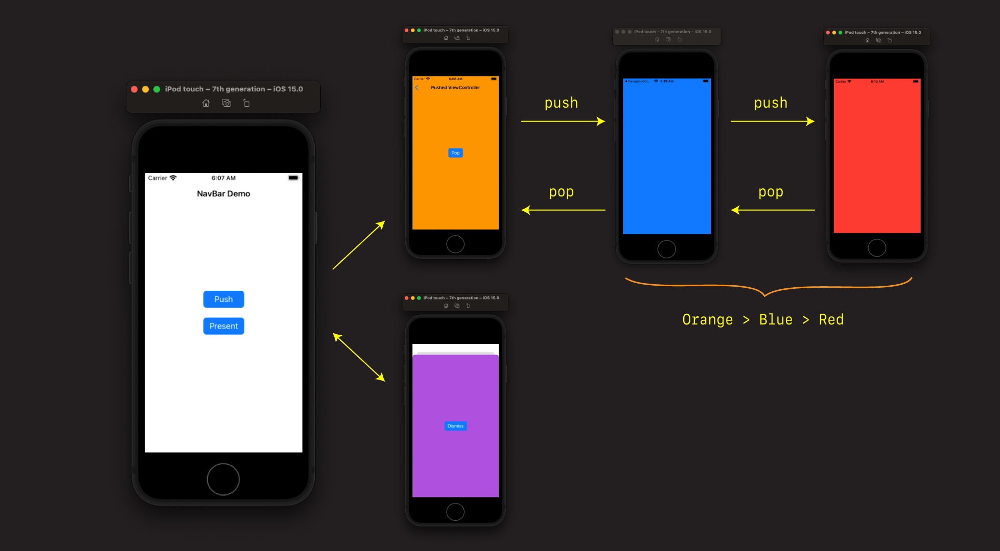
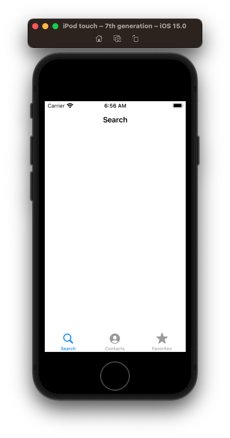
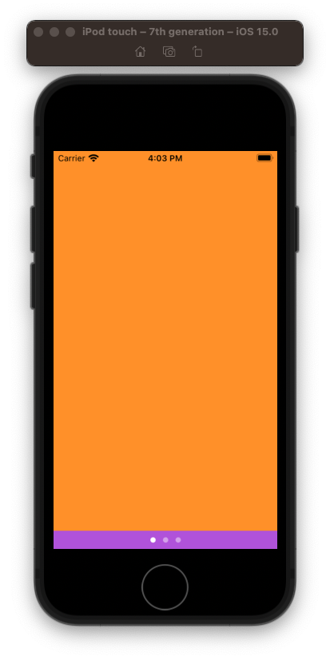

# Container View Controllers

- Where we are headed.


- To build this we need to first understand:
 - Container View Controllers
 - Scrollable View Controllers 

 
## What are they?


- Container view controllers are view controllers that combine content from child view controllers into a single working interface.

- `General` > `UINavigationViewController`.
- Starbucks, Netflix, Spotify >`UITabBarViewController`.
- Onboard > `UIPageViewController`.
- These are all Container View Controllers.

  - UINavigationController
  - UITabBarController
  - UIPageViewController
  - Custom container controllers we ourselves make

- And then all do the same thing. They take in child view controllers, and then handle how they're displayed.

For our app, we are going to use a `UITabBarController`. Which means we need to pass in all the VCs we want managed, and then let it figure out which one to display.

But before we set that up, lets quickly review each container view controllers to see how they work.

## UINavigationController

Demo and explain.


### Push / Pop

```swift
@objc func pushTapped(sender: UIButton) {
    navigationController?.pushViewController(PushViewController(), animated: true)
}

@objc func popTapped(sender: UIButton) {
    navigationController?.popViewController(animated: true)
}
```

### Present / Dismiss

```swift
@objc func presentTapped(sender: UIButton) {
    navigationController?.present(PresentViewController(), animated: true, completion: nil)
}

@objc func dismissTapped(sender: UIButton) {
    dismiss(animated: true, completion: nil)
}
```

### Demo



```swift
import UIKit

class ViewController: UIViewController {
    
    let stackView = UIStackView()
    let pushButton = UIButton(type: .system)
    let presentButton = UIButton(type: .system)
    
    override func viewDidLoad() {
        super.viewDidLoad()
        style()
        layout()
    }
    
    func style() {
        title = "NavBar Demo"

        stackView.translatesAutoresizingMaskIntoConstraints = false
        stackView.axis = .vertical
        stackView.spacing = 20
        
        pushButton.translatesAutoresizingMaskIntoConstraints = false
        pushButton.configuration = .filled()
        pushButton.setTitle("Push", for: [])
        pushButton.addTarget(self, action: #selector(pushTapped), for: .primaryActionTriggered)
        
        presentButton.translatesAutoresizingMaskIntoConstraints = false
        presentButton.configuration = .filled()
        presentButton.setTitle("Present", for: [])
        presentButton.addTarget(self, action: #selector(presentTapped), for: .primaryActionTriggered)
    }
    
    func layout() {
        stackView.addArrangedSubview(pushButton)
        stackView.addArrangedSubview(presentButton)
        
        view.addSubview(stackView)
        
        NSLayoutConstraint.activate([
            stackView.centerXAnchor.constraint(equalTo: view.centerXAnchor),
            stackView.centerYAnchor.constraint(equalTo: view.centerYAnchor),
        ])
    }
    
    @objc func pushTapped(sender: UIButton) {
        navigationController?.pushViewController(PushViewController(), animated: true)
    }
    
    @objc func presentTapped(sender: UIButton) {
        navigationController?.present(PresentViewController(), animated: true, completion: nil)
    }
}

class PushViewController: UIViewController {
    
    let stackView = UIStackView()
    let popButton = UIButton(type: .system)
    
    override func viewDidLoad() {
        super.viewDidLoad()
        style()
        layout()
    }
    
    func style() {
        title = "Pushed ViewController"
        view.backgroundColor = .systemOrange

        stackView.translatesAutoresizingMaskIntoConstraints = false
        stackView.axis = .vertical
        stackView.spacing = 20
        
        popButton.translatesAutoresizingMaskIntoConstraints = false
        popButton.configuration = .filled()
        popButton.setTitle("Pop", for: [])
        popButton.addTarget(self, action: #selector(popTapped), for: .primaryActionTriggered)
    }
    
    func layout() {
        stackView.addArrangedSubview(popButton)
        
        view.addSubview(stackView)
        
        NSLayoutConstraint.activate([
            stackView.centerXAnchor.constraint(equalTo: view.centerXAnchor),
            stackView.centerYAnchor.constraint(equalTo: view.centerYAnchor),
        ])
    }
    
    @objc func popTapped(sender: UIButton) {
        navigationController?.popViewController(animated: true)
    }
}

class PresentViewController: UIViewController {
    
    let stackView = UIStackView()
    let dismissButton = UIButton(type: .system)
    
    override func viewDidLoad() {
        super.viewDidLoad()
        style()
        layout()
    }
    
    func style() {
        title = "Not shown"
        view.backgroundColor = .systemPurple

        stackView.translatesAutoresizingMaskIntoConstraints = false
        stackView.axis = .vertical
        stackView.spacing = 20
        
        dismissButton.translatesAutoresizingMaskIntoConstraints = false
        dismissButton.configuration = .filled()
        dismissButton.setTitle("Dismiss", for: [])
        dismissButton.addTarget(self, action: #selector(dismissTapped), for: .primaryActionTriggered)
    }
    
    func layout() {
        stackView.addArrangedSubview(dismissButton)
        
        view.addSubview(stackView)
        
        NSLayoutConstraint.activate([
            stackView.centerXAnchor.constraint(equalTo: view.centerXAnchor),
            stackView.centerYAnchor.constraint(equalTo: view.centerYAnchor),
        ])
    }
    
    @objc func dismissTapped(sender: UIButton) {
        dismiss(animated: true, completion: nil)
    }
}
```


## UITabBarController

Demo and explain.



```swift
import UIKit

@main
class AppDelegate: UIResponder, UIApplicationDelegate {
    
    var window: UIWindow?
    
    func application(_ application: UIApplication, didFinishLaunchingWithOptions launchOptions: [UIApplication.LaunchOptionsKey: Any]?) -> Bool {
        
        window = UIWindow(frame: UIScreen.main.bounds)
        window?.makeKeyAndVisible()
        window?.backgroundColor = .systemBackground
        
        let vc1 = SearchViewController()
        let vc2 = ContactsViewController()
        let vc3 = FavoritesViewController()
        
        vc1.tabBarItem = UITabBarItem(tabBarSystemItem: .search, tag: 0)
        vc2.tabBarItem = UITabBarItem(tabBarSystemItem: .contacts, tag: 1)
        vc3.tabBarItem = UITabBarItem(tabBarSystemItem: .favorites, tag: 2)
        
        let nc1 = UINavigationController(rootViewController: vc1)
        let nc2 = UINavigationController(rootViewController: vc2)
        let nc3 = UINavigationController(rootViewController: vc3)
        
        let tabBarController = UITabBarController()
        tabBarController.viewControllers = [nc1, nc2, nc3]
        
        window?.rootViewController = tabBarController
        
        return true
    }
    
}

class SearchViewController: UIViewController {
    override func viewDidLoad() {
        title = "Search"
    }
}

class ContactsViewController: UIViewController {
    override func viewDidLoad() {
        title = "Contacts"
    }
}

class FavoritesViewController: UIViewController {
    override func viewDidLoad() {
        title = "Favorites"
    }
}
```

## UIPageViewController

Demo and explain. Also point out how this is a `Custom Container`.



```swift
import UIKit

class ViewController: UIViewController {

    let pageViewController: UIPageViewController
    var pages = [UIViewController]()
    var currentVC: UIViewController {
        didSet {
//            guard let index = pages.firstIndex(of: currentVC) else { return }
//            nextButton.isHidden = index == pages.count - 1
//            backButton.isHidden = index == 0
//            doneButton.isHidden = !(index == pages.count - 1)
        }
    }
    
    override init(nibName nibNameOrNil: String?, bundle nibBundleOrNil: Bundle?) {
        self.pageViewController = UIPageViewController(transitionStyle: .scroll, navigationOrientation: .horizontal, options: nil)
        
        let page1 = ViewController1()
        let page2 = ViewController2()
        let page3 = ViewController3()
        
        self.pages.append(page1)
        self.pages.append(page2)
        self.pages.append(page3)
        
        self.currentVC = pages.first!
        
        super.init(nibName: nibNameOrNil, bundle: nibBundleOrNil)
    }
    
    required init?(coder: NSCoder) {
        fatalError("init(coder:) has not been implemented")
    }
    
    override func viewDidLoad() {
        super.viewDidLoad()
        
        view.backgroundColor = .systemPurple
        
        addChild(pageViewController)
        view.addSubview(pageViewController.view)
        pageViewController.didMove(toParent: self)
        
        pageViewController.dataSource = self
        pageViewController.view.translatesAutoresizingMaskIntoConstraints = false
        
        NSLayoutConstraint.activate([
            view.topAnchor.constraint(equalTo: pageViewController.view.topAnchor),
            view.leadingAnchor.constraint(equalTo: pageViewController.view.leadingAnchor),
            view.trailingAnchor.constraint(equalTo: pageViewController.view.trailingAnchor),
            view.bottomAnchor.constraint(equalTo: pageViewController.view.bottomAnchor),
        ])
        
        pageViewController.setViewControllers([pages.first!], direction: .forward, animated: false, completion: nil)
        currentVC = pages.first!
    }
}

// MARK: - UIPageViewControllerDataSource

extension ViewController: UIPageViewControllerDataSource {

    func pageViewController(_ pageViewController: UIPageViewController, viewControllerBefore viewController: UIViewController) -> UIViewController? {
        return getPreviousViewController(from: viewController)
    }

    func pageViewController(_ pageViewController: UIPageViewController, viewControllerAfter viewController: UIViewController) -> UIViewController? {
        return getNextViewController(from: viewController)
    }

    private func getPreviousViewController(from viewController: UIViewController) -> UIViewController? {
        guard let index = pages.firstIndex(of: viewController), index - 1 >= 0 else { return nil }
        self.currentVC = pages[index - 1]
        return pages[index - 1]
    }

    private func getNextViewController(from viewController: UIViewController) -> UIViewController? {
        guard let index = pages.firstIndex(of: viewController), index + 1 < pages.count else { return nil }
        self.currentVC = pages[index + 1]
        return pages[index + 1]
    }

    func presentationCount(for pageViewController: UIPageViewController) -> Int {
        return pages.count
    }

    func presentationIndex(for pageViewController: UIPageViewController) -> Int {
        return pages.firstIndex(of: self.currentVC) ?? 0
    }
}

// MARK: - ViewControllers
class ViewController1: UIViewController {
    override func viewDidLoad() {
        super.viewDidLoad()
        view.backgroundColor = .systemOrange
    }
}

class ViewController2: UIViewController {
    override func viewDidLoad() {
        super.viewDidLoad()
        view.backgroundColor = .systemGreen
    }
}

class ViewController3: UIViewController {
    override func viewDidLoad() {
        super.viewDidLoad()
        view.backgroundColor = .systemBlue
    }
}
```

### Links that help

- [Implementing a Container View Controller](https://developer.apple.com/library/archive/featuredarticles/ViewControllerPGforiPhoneOS/)
- [Creating a Custom Container View Controller](https://developer.apple.com/documentation/uikit/view_controllers/creating_a_custom_container_view_controller)


