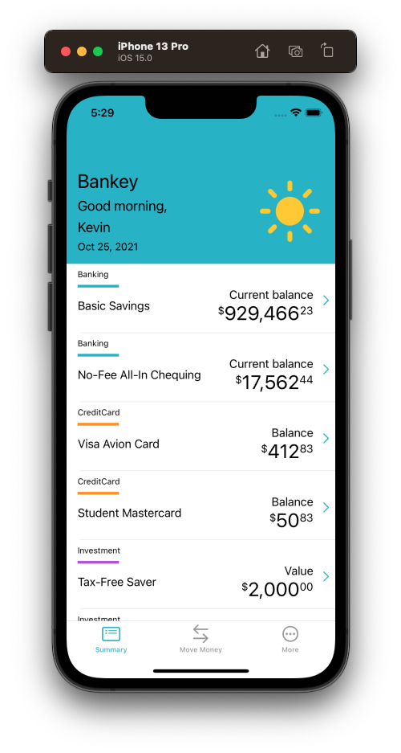
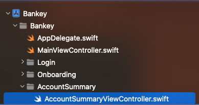
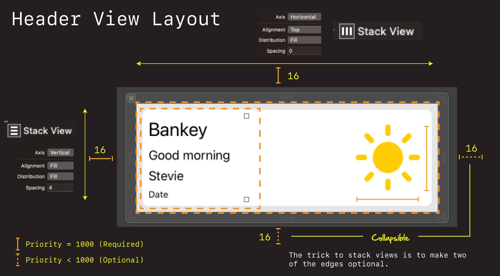
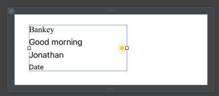
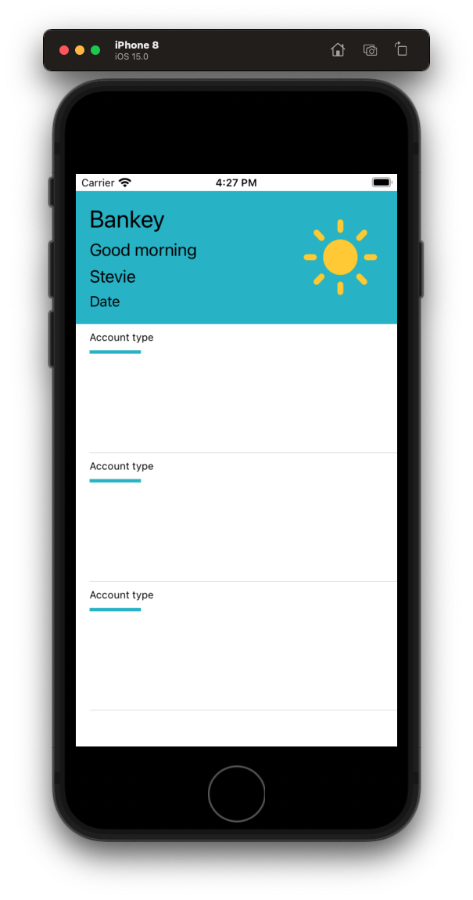
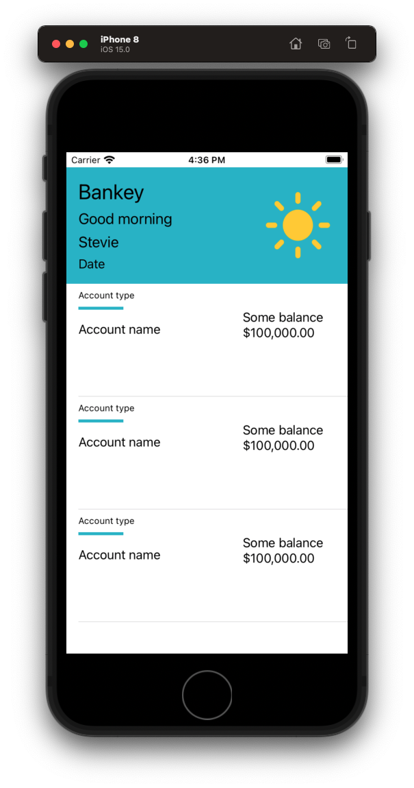
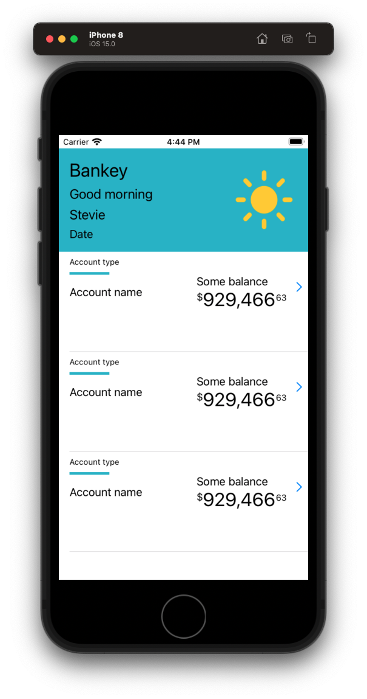
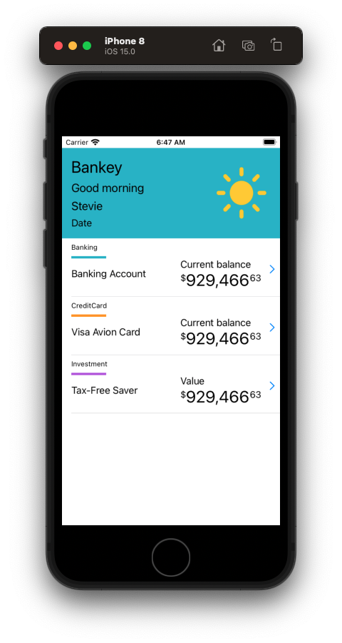

# Account Summary



## Setup

- Follow along with text if you like (will be copying and pasting code).
- Create a branch

```
> git checkout -b feat/BAN-3/account-summary
```

- Explain what a git branch is and why we use.
- .
- Demo the page
- Explain how it is laid out

## Create ViewController

- Create directory `AccountSummary`



- Create file `AccountSummaryViewController` (via snippet)
- Hook up in `AppDelegate`
- Delete old one in `MainViewController`
- Instantiate and run.

Ask students to follow along in the show notes and to copy and paste in the following to start things off.

**AccountSummaryViewController**

```swift
import UIKit

class AccountSummaryViewController: UIViewController {
    
    let games = [
        "Pacman",
        "Space Invaders",
        "Space Patrol",
    ]
    
    var tableView = UITableView()
    
    override func viewDidLoad() {
        super.viewDidLoad()
        setup()
    }
}

extension AccountSummaryViewController {
    private func setup() {
        setupTableView()
    }
    
    private func setupTableView() {
        tableView.delegate = self
        tableView.dataSource = self
        
        tableView.translatesAutoresizingMaskIntoConstraints = false
        view.addSubview(tableView)
        
        NSLayoutConstraint.activate([
            tableView.topAnchor.constraint(equalTo: view.safeAreaLayoutGuide.topAnchor),
            tableView.leadingAnchor.constraint(equalTo: view.safeAreaLayoutGuide.leadingAnchor),
            tableView.trailingAnchor.constraint(equalTo: view.safeAreaLayoutGuide.trailingAnchor),
            tableView.bottomAnchor.constraint(equalTo: view.safeAreaLayoutGuide.bottomAnchor)
        ])
    }
}

extension AccountSummaryViewController: UITableViewDataSource {
    func tableView(_ tableView: UITableView, cellForRowAt indexPath: IndexPath) -> UITableViewCell {
        let cell = UITableViewCell()
        cell.textLabel?.text = games[indexPath.row]
        return cell
    }
    
    func tableView(_ tableView: UITableView, numberOfRowsInSection section: Int) -> Int {
        return games.count
    }
}

extension AccountSummaryViewController: UITableViewDelegate {
    func tableView(_ tableView: UITableView, didSelectRowAt indexPath: IndexPath) {
        
    }
}
```

Discussion:

- Explain how this is pretty much the simplest table view controller we can get.
- Go over how it works.


Next let's add the header.

## Add Header View

- The simplest way to add a header to a `UITableView` with Auto Layout is to:
   - Create a class
   - Add it as a nib


- Discussion: 
   - [Interface Builder with Steve Jobs](https://youtu.be/dl0CbKYUFTY?t=62)
   - [What is a nib?](https://developer.apple.com/library/archive/documentation/General/Conceptual/DevPedia-CocoaCore/NibFile.html)
   - What are some of the pros and cons of using them.
      - Less code
      - Bit of a learning curve (need to load differently)
      - But you will see these used in industry (work knowing)

#### Create a class

- Create a folder in AccountSummary called `Header`
- Create a class `AccountSummaryHeaderView`

**AccountSummaryHeaderView**

```swift
import UIKit

class AccountSummaryHeaderView: UIView {

}
```

#### Create a nib

- Create a nib view named `AccountSummaryHeaderView`
- Set to height `144`
- Set `File's Owner` to `AccountSummaryHeaderView`
- Show how to bring up the assistant.
- Control drag `view` from nib into file and call `contentView`.
- Then load the nib and pin to the edges by copying and pasing code like this.
 
**AccountSummaryHeaderView**

```swift
import UIKit

class AccountSummaryHeaderView: UIView {
    
    @IBOutlet var contentView: UIView!
    
    override init(frame: CGRect) {
        super.init(frame: frame)
        commonInit()
    }
    
    required init?(coder aDecoder: NSCoder) {
        super.init(coder: aDecoder)
        commonInit()
    }
    
    override var intrinsicContentSize: CGSize {
        return CGSize(width: UIView.noIntrinsicMetric, height: 144)
    }
    
    private func commonInit() {
        let bundle = Bundle(for: AccountSummaryHeaderView.self)
        bundle.loadNibNamed("AccountSummaryHeaderView", owner: self, options: nil)
        addSubview(contentView)
        contentView.backgroundColor = appColor
        
        contentView.translatesAutoresizingMaskIntoConstraints = false
        contentView.topAnchor.constraint(equalTo: self.topAnchor).isActive = true
        contentView.rightAnchor.constraint(equalTo: self.rightAnchor).isActive = true
        contentView.bottomAnchor.constraint(equalTo: self.bottomAnchor).isActive = true
        contentView.leftAnchor.constraint(equalTo: self.leftAnchor).isActive = true
    }
}
```

- Explain how nibs get loaded via the `Bundle`.
- How we add `contentView` to subview.
- Pin to edges uses Auto Layout.
- Now add it to the table.

```swift
setupTableHeaderView()

private func setupTableHeaderView() {
    let header = AccountSummaryHeaderView(frame: .zero)
    
    var size = header.systemLayoutSizeFitting(UIView.layoutFittingCompressedSize)
    size.width = UIScreen.main.bounds.width
    header.frame.size = size
    
    tableView.tableHeaderView = header
}        
```


### Styling the header

- Now because we have a nib, we can do all our auto layout in there.
- Challenge - how should we do it? 
- Explain how we are going to layout using stack views (draw out).




#### Horizontal Stack View #1

Drag out the following and embed in a horizontal stack view.

- `logoLabel` - `title1`, Bankey
- `greetingLabel` - `title3`, Good morning, 
- `nameLabel` - `title3`, Jonathan
- `dateLablel` - `body`, Date

#### Vertical Stack View #2

- Add a `UIImageView`
- Assign it `SFSymbol` named `sun.max.fill`
- Tint system yellow (not background)
- Select it and horizontal stack and embed in vertical stack (if embed option not showing up after selecting try collapsing stack view let this)




#### Layout

- Pin parent stack view to edges `16 pt`.
- Assign image view `height >= 100` and `width = 100`
- Resolve any left over ambiguity


Explain what CHCR means and how to fix.


Bankey.


- Explain how Xcode will assign CHCR on your behalf when working with controls like labels and text fields.
- Set `View` background to `appColor`.

Layout as follows:


Should now look like this.


Header looking good. 

Discussion:

- How to know your layout doesn't have any ambiguity
- Check console
- Demo Reveal

Save your work.


```
> git add .
> git commit -m "feat: Add header view"
> git push
```

See the branch our work is on. Show how to switch branches.

```
> git log
> git branch
> git checkout main
> git checkout feat/BAN-3/account-summary
```

This how developers work on multiple features, bugs, simultaneously. Don't want a tonne of branches. But a couple are OK. Try to work on one branch at a time.

Next let's define a cell for our table view.

## Creating the customer table view cell

- Explain what table view cells are
- How they work
- Why iOS is able to scroll so quickly and be so efficient

While we could do this with a nib, let's do this one entirely programmatically so you can see how that would work.

Create a new class in Account Summary called `AccountSummaryCell`.

**AccountSummaryCell**

```swift
import Foundation
import UIKit

class AccountSummaryCell: UITableViewCell {
    
    override init(style: UITableViewCell.CellStyle, reuseIdentifier: String?) {
        super.init(style: style, reuseIdentifier: reuseIdentifier)
        setup()
        layout()
    }
    
    required init?(coder aDecoder: NSCoder) {
        fatalError("init(coder:) has not been implemented")
    }
    
}

extension AccountSummaryCell {
    
    private func setup() {

    }
    
    private func layout() {
        
    }
}
```

Create image showing layout.

Let's add all the elements then style them one-by-one. Starting with the account `typeLabel`.

### typeLabel
```swift
let typeLabel = UILabel()
let underlineView = UIView()
let nameLabel = UILabel()
    
let balanceStackView = UIStackView()
let balanceLabel = UILabel()
let balanceAmountLabel = UILabel()
    
let chevonImageView = UIImageView()

static let reuseID = "AccountSummaryCell"
static let rowHeight: CGFloat = 100

typeLabel.translatesAutoresizingMaskIntoConstraints = false
typeLabel.font = UIFont.preferredFont(forTextStyle: .caption1)
typeLabel.adjustsFontForContentSizeCategory = true
typeLabel.text = "Account type"

contentView.addSubview(typeLabel) // imporant!

typeLabel.topAnchor.constraint(equalToSystemSpacingBelow: topAnchor, multiplier: 1),
typeLabel.leadingAnchor.constraint(equalToSystemSpacingAfter: leadingAnchor, multiplier: 1),
```

Now let's go register and dequeue this cell in our view controller.

**AccountSummaryViewController**

```swift
private func setupTableView() {
    tableView.delegate = self
    tableView.dataSource = self
    
    tableView.register(AccountSummaryCell.self, forCellReuseIdentifier: AccountSummaryCell.reuseID)
    tableView.rowHeight = AccountSummaryCell.rowHeight
    tableView.tableFooterView = UIView()
    
    view = tableView
}

func tableView(_ tableView: UITableView, cellForRowAt indexPath: IndexPath) -> UITableViewCell {
    let cell = tableView.dequeueReusableCell(withIdentifier: AccountSummaryCell.reuseID, for: indexPath) as! AccountSummaryCell
    return cell
}
```


Discussion on Cell height:

 - if your cell height heights are all the same recommend way to set cell height is once for all cells like this:

 `tableView.rowHeight = AccountSummaryCell.rowHeight`

 - if your cell heights vary by cell you can introduce logic and set them specifically like this

```swift
func tableView(_ tableView: UITableView, heightForRowAt indexPath: IndexPath) -> CGFloat {
    return AccountSummaryCell.rowHeight
}
```

#### Thinking challenge: How to add underline bar

- How would you do this?
- Spend 10 seconds thinking about it then come back and we'll implement together.
- Discussion: Everything is a view
- When you see blocks and rectangles like this, just think view. Most dividers and underlines are done this way.

### underlineView

```swift
underlineView.translatesAutoresizingMaskIntoConstraints = false
underlineView.backgroundColor = .systemTeal

contentView.addSubview(underlineView)

underlineView.topAnchor.constraint(equalToSystemSpacingBelow: typeLabel.bottomAnchor, multiplier: 1),
underlineView.leadingAnchor.constraint(equalToSystemSpacingAfter: leadingAnchor, multiplier: 2),
underlineView.widthAnchor.constraint(equalToConstant: 60),
underlineView.heightAnchor.constraint(equalToConstant: 4),
```



### nameLabel - Challange

See if you can lay this one out:

- font: `.body`
- text: `Account name`
- topSpace: `16pts` (multiplier or x2)
- leading:  `16pts` (multiplier or x2)

```swift
nameLabel.translatesAutoresizingMaskIntoConstraints = false
nameLabel.font = UIFont.preferredFont(forTextStyle: .body)
nameLabel.text = "Account name"
    
contentView.addSubview(nameLabel)
    
nameLabel.topAnchor.constraint(equalToSystemSpacingBelow: underlineView.bottomAnchor, multiplier: 2),
nameLabel.leadingAnchor.constraint(equalToSystemSpacingAfter: leadingAnchor, multiplier: 2),
```


### Balance labels

Going to do something a bit different here. Instead of laying out each individually, going to embed into a stack view.

```swift
balanceStackView.translatesAutoresizingMaskIntoConstraints = false
balanceStackView.axis = .vertical
balanceStackView.spacing = 0

balanceLabel.translatesAutoresizingMaskIntoConstraints = false
balanceLabel.font = UIFont.preferredFont(forTextStyle: .body)
balanceLabel.textAlignment = .right
balanceLabel.text = "Some balance"

balanceAmountLabel.translatesAutoresizingMaskIntoConstraints = false
balanceAmountLabel.textAlignment = .right
balanceAmountLabel.text = "$929,466.63"

balanceStackView.addArrangedSubview(balanceLabel)
balanceStackView.addArrangedSubview(balanceAmountLabel)
    
contentView.addSubview(balanceStackView)

balanceStackView.topAnchor.constraint(equalToSystemSpacingBelow: underlineView.bottomAnchor, multiplier: 0),
trailingAnchor.constraint(equalToSystemSpacingAfter: balanceStackView.trailingAnchor, multiplier: 4),
```



### chevonImageView

```swift
chevonImageView.translatesAutoresizingMaskIntoConstraints = false
chevonImageView.image = UIImage(systemName: "chevron.right")

contentView.addSubview(chevonImageView)

chevonImageView.topAnchor.constraint(equalToSystemSpacingBelow: underlineView.bottomAnchor, multiplier: 1),
trailingAnchor.constraint(equalToSystemSpacingAfter: chevonImageView.trailingAnchor, multiplier: 1)
```


### NSAttributedStrings

- Demo / explain what these things are and how they work.
- Let's use these to make our balance fancy 🚀

```swift
extension AccountSummaryCell {
    private func makeFormattedBalance(dollars: String, cents: String) -> NSMutableAttributedString {
        let dollarSignAttributes: [NSAttributedString.Key: Any] = [.font: UIFont.preferredFont(forTextStyle: .callout), .baselineOffset: 8]
        let dollarAttributes: [NSAttributedString.Key: Any] = [.font: UIFont.preferredFont(forTextStyle: .title1)]
        let centAttributes: [NSAttributedString.Key: Any] = [.font: UIFont.preferredFont(forTextStyle: .footnote), .baselineOffset: 8]
        
        let rootString = NSMutableAttributedString(string: "$", attributes: dollarSignAttributes)
        let dollarString = NSAttributedString(string: dollars, attributes: dollarAttributes)
        let centString = NSAttributedString(string: cents, attributes: centAttributes)
        
        rootString.append(dollarString)
        rootString.append(centString)
        
        return rootString
    }
}

balanceAmountLabel.attributedText = makeFormattedBalance(dollars: "100,000", cents: "00")
```



U R HERE

## Making the tile dynamic

Now this is nice, but what would be really nice is if we could re-use this account tile view for different types of accounts.

Turns out we can. We just need to give it a way to determine what account type to display, and then give it the neccessary details.

Enums are really good for this. Let's start by defining an account type, and then seeing what data we need to vary by type.

Discussion

- enums
- ViewModel
- passing in data via the viewModel

### Using enums for types

**AccountSummaryTile**

We can capture the variations in our cell like this.

```swift
enum AccountType: String {
    case Banking
    case CreditCards
    case Investments
}
```

### Representing view data with ViewModels

And we can represent the data for any given type like this.

```swift    
struct ViewModel {
    let accountType: AccountType
    let accountName: String
    let balanceTitle: String
    let balanceAmount: Decimal
}
```

Advantages:

- clean separation between back and front end
- lets you build what you need in the UI
- while giving you a place to translation from the backend later
- facilitates easy unit testing
- decouples backed from front end 

Let's start by simplying introducing an enum for `AccountType` and a ViewModel with `accountType` that can be figured after the cell has loaded.

**AccountSummaryCell**

```swift
enum AccountType: String {
    case Banking
    case CreditCard
    case Investment
}
```

Sticking this in `AccountSummaryCell` to signal this type is only for this cell. Could put externally but then you start to run into name clashes. This avoids that.

Next let's define a view model for this cell and give it an `accountType` and `accountName`.

```swift    
struct ViewModel {
    let accountType: AccountType
    let accountName: String
}

let viewModel: ViewModel? = nil
```

ViewModel is optional because we won't know what data this cell has when its initially dequeued in the table. But we'll set after imitating the flow as if it got set as the result of a network call.

First we'll add the configuration method:

```swift
extension AccountSummaryCell {
    func configure(with vm: ViewModel) {
    }
}
```

Then look and see how we can vary configuration based on type:

```swift
extension AccountSummaryCell {
    func configure(with vm: ViewModel) {
        switch vm.accountType {
        case .Banking:
            break
        case .CreditCard:
            break
        case .Investment:
            break
        }
    }
}
```

Now we have a place to vary our cell configuration. All we need to do is set it when the cell gets created.

First let's get rid of our old game data model (delete `games`). And instead replace it and empty data set containing exactly the data we want.

**AccountSummaryViewController**

```swift
class AccountSummaryViewController: UIViewController {
    var accounts: [AccountSummaryCell.ViewModel] = []
    var tableView = UITableView()
}

func tableView(_ tableView: UITableView, numberOfRowsInSection section: Int) -> Int {
    return accounts.count
}
```

Then let's pretend to fetch the data over the network like this:

```swift
extension AccountSummaryViewController {
    private func setup() {
        setupTableView()
        setupTableHeaderView()
        fetchData()
    }
}

extension AccountSummaryViewController {
    private func fetchData() {
        let banking1 = AccountSummaryCell.ViewModel(accountType: .Banking)
        let creditCard1 = AccountSummaryCell.ViewModel(accountType: .CreditCard)
        let investment1 = AccountSummaryCell.ViewModel(accountType: .Investment)
        
        accounts.append(banking1)
        accounts.append(creditCard1)
        accounts.append(investment1)
    }
}
```

And then pass it to our cell like this.

```swift
extension AccountSummaryViewController: UITableViewDataSource {
    func tableView(_ tableView: UITableView, cellForRowAt indexPath: IndexPath) -> UITableViewCell {
        guard !accounts.isEmpty else { return UITableViewCell() }
        
        let cell = tableView.dequeueReusableCell(withIdentifier: AccountSummaryCell.reuseID, for: indexPath) as! AccountSummaryCell
        let account = accounts[indexPath.row]
        cell.configure(with: account)
        
        return cell
    }
}
```

Now if we run the app, we won't notice anything different. Everything looks the same.

But watch what happens when we leverage the account type. Because our account type enum is a string, we can use if for setting the `typeLabel`.

```swift
extension AccountSummaryCell {
    func configure(with vm: ViewModel) {
        
        typeLabel.text = vm.accountType.rawValue
        
        switch vm.accountType {
        case .Banking:
            break
        case .CreditCard:
            break
        case .Investment:
            break
        }
    }
}
```


But wait. It gets better. Because we can now vary by type, we can further configure our cell based on very specifiy things. Like setting the `underlineView` color.

```swift
extension AccountSummaryCell {
    func configure(with vm: ViewModel) {
        
        typeLabel.text = vm.accountType.rawValue
        
        switch vm.accountType {
        case .Banking:
            underlineView.backgroundColor = .systemTeal
        case .CreditCard:
            underlineView.backgroundColor = .systemOrange
        case .Investment:
            underlineView.backgroundColor = .systemPurple
        }
    }
}
```


And now the world is our oyster. We can set and configure anything we want in this cell simply by:

- updating the `ViewModel`
- leverage the `accountType` via the switch

### Adding account name

For example let's add the account name to our viewModel.

```swift
struct ViewModel {
    let accountType: AccountType
    let accountName: String
}
```

Update our fetched data to pretend we also got that passed from the backed.

```swift
let banking1 = AccountSummaryCell.ViewModel(accountType: .Banking, accountName: "Banking Account")
let creditCard1 = AccountSummaryCell.ViewModel(accountType: .CreditCard, accountName: "Visa Avion Card")
let investment1 = AccountSummaryCell.ViewModel(accountType: .Investment, accountName: "Tax-Free Saver")
```

And then leverage that in `configure`.

`nameLabel.text = vm.accountName`

### Challenge: Update balance and balance label

This is a two part challenge.

In Part I - Given these two new fields on our ViewModel.

```swift
struct ViewModel {
    let accountType: AccountType
    let accountName: String
    let balanceAmount: Decimal // new
}
```

See if you can update the `balanceLabel` so that if `accountType`:

- is `Banking` or `CreditCard` the `balanceLabel` says `Current balance`.
- is `Investment` the `balanceLabel` says `Value`.

In Part II update the view so that when a `balanceAmount` is passed in as part of the view model, the `balanceAmountLabel` updates.

- Give `Banking` a balance of `$929,466.63`
- Give `CreditCard` a balance of `$0.00`
- Give `Investment` a balance of `$2000.00`

Now be careful - you are going to have to figure out how to convert that `balanceAmount: Decimal` into `String` for dollars and cents. But I think you can do it. Give it a go, see what kind of challenges you run into, and then come back and we'll do it together. Good luck!

### Solution

OK lets start with the easy part. Let's first update the balance label depending on the `accountType` passed in.

```swift
extension AccountSummaryCell {
    func configure(with vm: ViewModel) {
        
        typeLabel.text = vm.accountType.rawValue
        nameLabel.text = vm.accountName
        
        switch vm.accountType {
        case .Banking:
            underlineView.backgroundColor = .systemTeal
            balanceLabel.text = "Current balance"
        case .CreditCard:
            underlineView.backgroundColor = .systemOrange
            balanceLabel.text = "Current balance"
        case .Investment:
            underlineView.backgroundColor = .systemPurple
            balanceLabel.text = "Value"
        }
    }
}
```

If we run that now we'll see the balance label properly set.



Next comes the tricky part. We need to update our view model so that when we pass in a balance.

```swift
struct ViewModel {
    let accountType: AccountType
    let accountName: String
    let balanceAmount: Decimal // new
}

let banking1 = AccountSummaryCell.ViewModel(accountType: .Banking,
                                            accountName: "Banking Account",
                                            balanceAmount: 929466.23)
let creditCard1 = AccountSummaryCell.ViewModel(accountType: .CreditCard,
                                               accountName: "Visa Avion Card",
                                               balanceAmount: 0.00)
let investment1 = AccountSummaryCell.ViewModel(accountType: .Investment,
                                               accountName: "Tax-Free Saver",
                                               balanceAmount: 2000)
```

We some how convert that `Decimal` into a two part String.

This is actually harder than it looks. Could do it very simply by converting to string, parsing out dollars and cents and passing in.

But I want to show you a more fully featured way that will

- format the amount in the local the user is working in (adding the comma)
- and then use that output to pass to our dollars and cent attributed string

Do all this in a playground.

- explain what playgrounds are and how to use
- faster iterations
- would normally also write unit tests.. but get into that later

Steps:

- first we have to convert our `Decial` into a `Double` because that is what number formatter uses
- then we need to convert that `Double` into dollars and cents formatted
- then we need to separate out the dollars and cents
- then can pass to attributed string func

Create a file `Decimal+Utils` and into there copy.

```
extension Decimal {
    var doubleValue: Double {
        return NSDecimalNumber(decimal:self).doubleValue
    }
}
```

Discussion

- why did we choose `Decimal` as our money type
- why file named `Decimal+Utils`
- why conversion required

Then we can format like this:

```swift
struct ViewModel {
    let accountType: AccountType
    let accountName: String
    let balanceAmount: Decimal
    
    var balanceFormatted: String {
        let formatter = NumberFormatter()
        formatter.numberStyle = .currency
        formatter.usesGroupingSeparator = true
        
        let doubleValue = balanceAmount.doubleValue
        if let result = formatter.string(from: doubleValue as NSNumber) {
            return result
        }
        
        return ""
    }
}
```

Then we need to separate out as dollars and cents.

```swift
var balanceDollarsAndCents: (String, String) {
    return ("100", "00")
}
```

which can then become.

```swift
    var balanceDollarsAndCents: (String, String) {
        let parts = modf(balanceAmount.doubleValue)
        let dollars = String(format: "%.0f", parts.0)
        let cents = String(format: "%.0f", parts.1 * 100)
        
        return (dollars, cents)
    }
```

Discussion

- what is a tuple
- why are we grabbing the `decimalSeparator`

Now show them how to take this one step further with `NSAttributedString`.

Explain NSAttributedString.

Combine all together like this.

```swift
//        balanceAmountLabel.text = vm.balanceFormatted
let dollarsAndCentsTuple = vm.balanceDollarsAndCents
balanceAmountLabel.attributedText = makeFormattedBalance(dollars: dollarsAndCentsTuple.0,
                                                         cents: dollarsAndCentsTuple.1)
```

### Links that help

- [What are nibs?](https://developer.apple.com/library/archive/documentation/General/Conceptual/DevPedia-CocoaCore/NibFile.html)
- [Container Views](https://developer.apple.com/library/archive/featuredarticles/ViewControllerPGforiPhoneOS/ImplementingaContainerViewController.html)
- [Table Headers & Footer](https://developer.apple.com/documentation/uikit/views_and_controls/table_views/adding_headers_and_footers_to_table_sections)