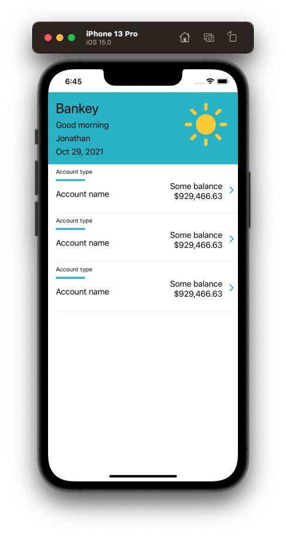
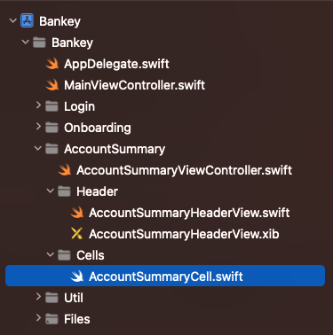
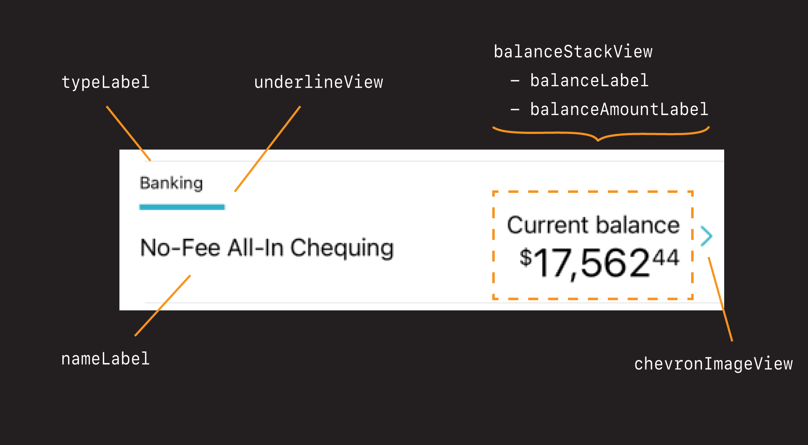
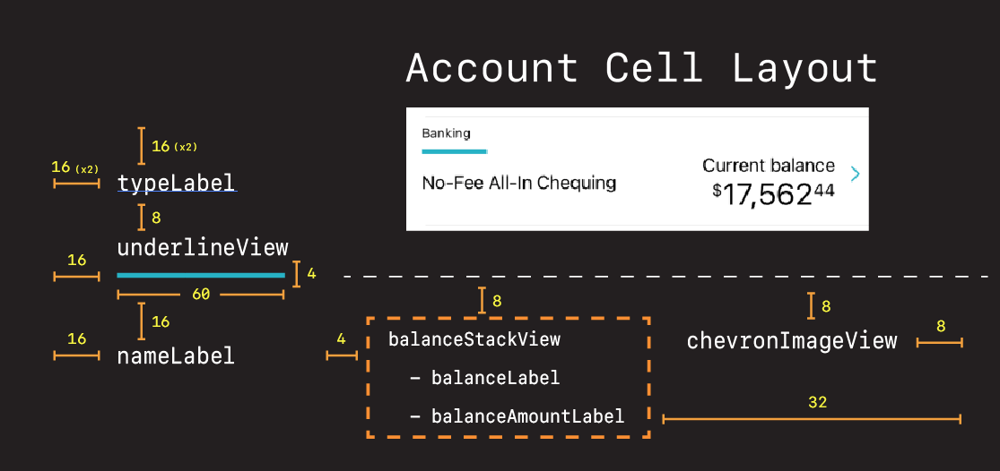
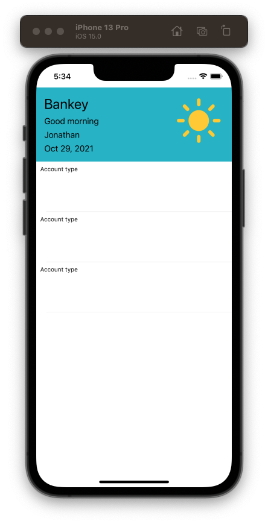
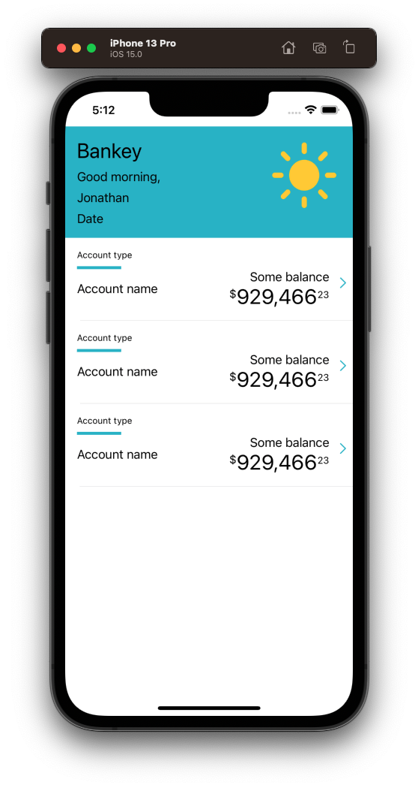
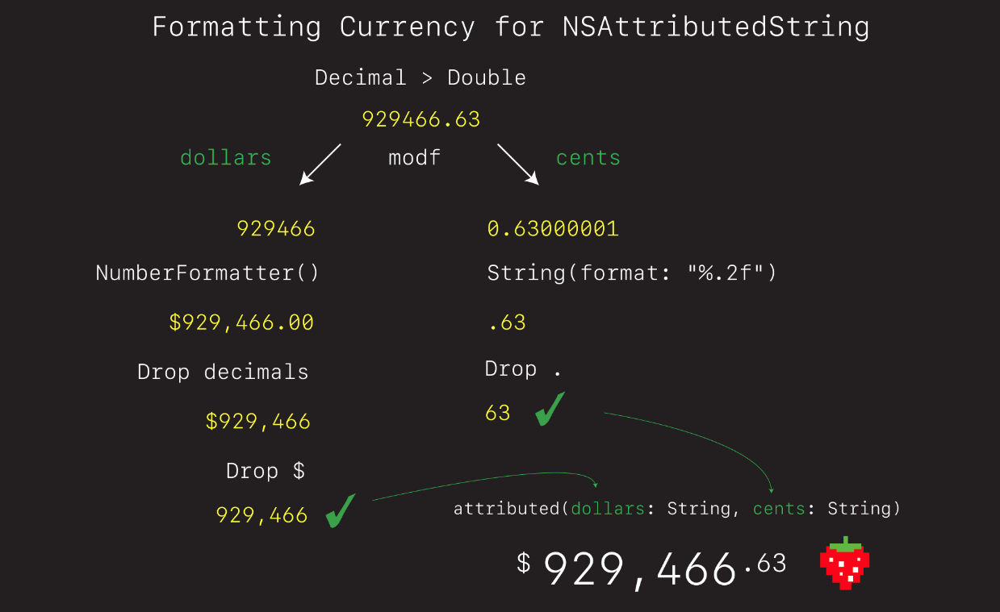

# Account Summary Cell

Setup

- Open browser to cell page
- Review where we are in the project (show git log)
- Demo where we are (run current app) and show where we are going (finished cell)



- Explain what table view cells are
- How they work
- Why iOS is able to scroll so quickly and be so efficient
- Explain that we could do this with a nib, but lets do this one entirely programmatically so you can see how that would work.

Setup:



- Create a folder in `AccountSummary` called `Header`
- Put header files in there
- Create a another folder in `AccountSummary` called `Cells`
- Create a new class in `Cells` called `AccountSummaryCell`.

**AccountSummaryCell**

```swift
import Foundation
import UIKit

class AccountSummaryCell: UITableViewCell {
    
    override init(style: UITableViewCell.CellStyle, reuseIdentifier: String?) {
        super.init(style: style, reuseIdentifier: reuseIdentifier)
        setup()
        layout()
    }
    
    required init?(coder aDecoder: NSCoder) {
        fatalError("init(coder:) has not been implemented")
    }
    
}

extension AccountSummaryCell {
    
    private func setup() {

    }
    
    private func layout() {
        
    }
}
```

## Layout

How we are going to lay this out.





Let's add all the elements then style them one-by-one. Starting with the account `typeLabel`.

### typeLabel

```swift
let typeLabel = UILabel()

static let reuseID = "AccountSummaryCell"
static let rowHeight: CGFloat = 100

typeLabel.translatesAutoresizingMaskIntoConstraints = false
typeLabel.font = UIFont.preferredFont(forTextStyle: .caption1)
typeLabel.adjustsFontForContentSizeCategory = true
typeLabel.text = "Account type"

contentView.addSubview(typeLabel) // imporant! Add to contentView.

NSLayoutConstraint.activate([
    typeLabel.topAnchor.constraint(equalToSystemSpacingBelow: topAnchor, multiplier: 2),
    typeLabel.leadingAnchor.constraint(equalToSystemSpacingAfter: leadingAnchor, multiplier: 2),
])
```

Now let's go register and dequeue this cell in our view controller.

**AccountSummaryViewController**

```swift
private func setupTableView() {
    tableView.delegate = self
    tableView.dataSource = self
    
    tableView.register(AccountSummaryCell.self, forCellReuseIdentifier: AccountSummaryCell.reuseID)
    tableView.rowHeight = AccountSummaryCell.rowHeight
    tableView.tableFooterView = UIView()
}

func tableView(_ tableView: UITableView, cellForRowAt indexPath: IndexPath) -> UITableViewCell {
    let cell = tableView.dequeueReusableCell(withIdentifier: AccountSummaryCell.reuseID, for: indexPath) as! AccountSummaryCell
    return cell
}
```



Run the app.

Discussion on auto layout APIs:

We could have done our auto layout in the cell explicitly like this:

```swift
typeLabel.topAnchor.constraint(equalTo: topAnchor, constant: 16),
typeLabel.leadingAnchor.constraint(equalTo: leadingAnchor, constant: 16),
```

- Demo constraits using fluid constraint language.
   - How it reads.
   - Advantage of standard spacing.
   - Preferrred approach.
- Demo constraints using constant values (i.e. `8` and `16`)
   - Why spaces are not multiples of 8pts.
   - Good for non-standard sizing.

Discussion on Cell height:

 - if your cell height heights are all the same recommend way to set cell height is once for all cells like this:

 `tableView.rowHeight = AccountSummaryCell.rowHeight`

 - if your cell heights vary by cell you can introduce logic and set them specifically like this

```swift
func tableView(_ tableView: UITableView, heightForRowAt indexPath: IndexPath) -> CGFloat {
    return AccountSummaryCell.rowHeight
}
```

#### Thinking challenge: How to add underline bar

- How would you do this?
- Spend 10 seconds thinking about it then come back and we'll implement together.
- Discussion: Everything is a view
- When you see blocks and rectangles like this, just think view. Most dividers and underlines are done this way.

### underlineView

**AccountSummaryCell **


```swift
let underlineView = UIView()

underlineView.translatesAutoresizingMaskIntoConstraints = false
underlineView.backgroundColor = appColor

contentView.addSubview(underlineView)

underlineView.topAnchor.constraint(equalToSystemSpacingBelow: typeLabel.bottomAnchor, multiplier: 1),
underlineView.leadingAnchor.constraint(equalToSystemSpacingAfter: leadingAnchor, multiplier: 2),
underlineView.widthAnchor.constraint(equalToConstant: 60),
underlineView.heightAnchor.constraint(equalToConstant: 4),
```


### nameLabel - Challange

See if you can lay this one out:

- font: `.body`
- text: `Account name`
- topSpace: `16pts` (multiplier or x2)
- leading:  `16pts` (multiplier or x2)
- trailing: ignore for now (this is enough to define)

```swift
let nameLabel = UILabel()
    
nameLabel.translatesAutoresizingMaskIntoConstraints = false
nameLabel.font = UIFont.preferredFont(forTextStyle: .body)
nameLabel.text = "Account name"
    
contentView.addSubview(nameLabel)
    
nameLabel.topAnchor.constraint(equalToSystemSpacingBelow: underlineView.bottomAnchor, multiplier: 2),
nameLabel.leadingAnchor.constraint(equalToSystemSpacingAfter: leadingAnchor, multiplier: 2),
```


### Balance labels

Going to do something a bit different here. Instead of laying out each individually, going to embed into a stack view.

```swift
let balanceStackView = UIStackView()
let balanceLabel = UILabel()
let balanceAmountLabel = UILabel()
    
balanceStackView.translatesAutoresizingMaskIntoConstraints = false
balanceStackView.axis = .vertical
balanceStackView.spacing = 0

balanceLabel.translatesAutoresizingMaskIntoConstraints = false
balanceLabel.font = UIFont.preferredFont(forTextStyle: .body)
balanceLabel.textAlignment = .right
balanceLabel.text = "Some balance"

balanceAmountLabel.translatesAutoresizingMaskIntoConstraints = false
balanceAmountLabel.textAlignment = .right
balanceAmountLabel.text = "$929,466.63"

balanceStackView.addArrangedSubview(balanceLabel)
balanceStackView.addArrangedSubview(balanceAmountLabel)
    
contentView.addSubview(balanceStackView)

balanceStackView.topAnchor.constraint(equalToSystemSpacingBelow: underlineView.bottomAnchor, multiplier: 0),
balanceStackView.leadingAnchor.constraint(equalTo: nameLabel.trailingAnchor, constant: 4),
trailingAnchor.constraint(equalToSystemSpacingAfter: balanceStackView.trailingAnchor, multiplier: 4),
```


### chevonImageView

```swift
let chevronImageView = UIImageView()

chevronImageView.translatesAutoresizingMaskIntoConstraints = false
let chevronImage = UIImage(systemName: "chevron.right")!.withTintColor(appColor, renderingMode: .alwaysOriginal)
chevronImageView.image = chevronImage

contentView.addSubview(chevronImageView)

chevronImageView.topAnchor.constraint(equalToSystemSpacingBelow: underlineView.bottomAnchor, multiplier: 1),
trailingAnchor.constraint(equalToSystemSpacingAfter: chevronImageView.trailingAnchor, multiplier: 1)
```


### Save your work

OK at this point we have successfully styled our cell. Let's save our work. Note how all this work is still on our branch.

```
> git add .
> git commit -m "feat: Style cell view"
```


### NSAttributedStrings

- Demo / explain what these things are and how they work.
- Let's use these to make our balance fancy 🚀

```swift
extension AccountSummaryCell {
    private func makeFormattedBalance(dollars: String, cents: String) -> NSMutableAttributedString {
        let dollarSignAttributes: [NSAttributedString.Key: Any] = [.font: UIFont.preferredFont(forTextStyle: .callout), .baselineOffset: 8]
        let dollarAttributes: [NSAttributedString.Key: Any] = [.font: UIFont.preferredFont(forTextStyle: .title1)]
        let centAttributes: [NSAttributedString.Key: Any] = [.font: UIFont.preferredFont(forTextStyle: .footnote), .baselineOffset: 8]
        
        let rootString = NSMutableAttributedString(string: "$", attributes: dollarSignAttributes)
        let dollarString = NSAttributedString(string: dollars, attributes: dollarAttributes)
        let centString = NSAttributedString(string: cents, attributes: centAttributes)
        
        rootString.append(dollarString)
        rootString.append(centString)
        
        return rootString
    }
}

balanceAmountLabel.attributedText = makeFormattedBalance(dollars: "929,466", cents: "23")
static let rowHeight: CGFloat = 112
```



Let's save our work. But this time incrementally.

```
> git add -p
> git commit -m "feat: Format bank balance"
```

To get rid of changes, or start over at last commit:

```
> git reset --hard
```

## View Models

Now this is nice, but what would be really nice is if we could re-use this account tile view for different types of accounts.

Turns out we can. We just need to give it a way to determine what account type to display, and then give it the neccessary details.

Enums are really good for this. Let's start by defining an account type, and then seeing what data we need to vary by type.

Discussion

- enums
- ViewModel
- passing in data via the viewModel


Let's start by simplying introducing an enum for `AccountType` and a ViewModel with `accountType` that can be figured after the cell has loaded.

**AccountSummaryCell**

```swift
enum AccountType: String {
    case Banking
    case CreditCard
    case Investment
}
```

Sticking this in `AccountSummaryCell` to signal this type is only for this cell. Could put externally but then you start to run into name clashes. This avoids that.

Next let's define a view model for this cell and give it an `accountType` and `accountName`.

```swift    
struct ViewModel {
    let accountType: AccountType
    let accountName: String
}

let viewModel: ViewModel? = nil
```

ViewModel is optional because we won't know what data this cell has when its initially dequeued in the table. But we'll set after imitating the flow as if it got set as the result of a network call.

First we'll add the configuration method:

```swift
extension AccountSummaryCell {
    func configure(with vm: ViewModel) {
    }
}
```

Then look and see how we can vary configuration based on type:

```swift
extension AccountSummaryCell {
    func configure(with vm: ViewModel) {
        switch vm.accountType {
        case .Banking:
            break
        case .CreditCard:
            break
        case .Investment:
            break
        }
    }
}
```

Now we have a place to vary our cell configuration. All we need to do is set it when the cell gets created.

First let's get rid of our old game data model (delete `games`). And instead replace it and empty data set containing exactly the data we want.

**AccountSummaryViewController**

```swift
class AccountSummaryViewController: UIViewController {
    var accounts: [AccountSummaryCell.ViewModel] = []
    var tableView = UITableView()
}

func tableView(_ tableView: UITableView, numberOfRowsInSection section: Int) -> Int {
    return accounts.count
}
```

Then let's pretend to fetch the data over the network like this:

```swift
extension AccountSummaryViewController {
    private func setup() {
        setupTableView()
        setupTableHeaderView()
        fetchData()
    }
}

extension AccountSummaryViewController {
    private func fetchData() {
        let savings = AccountSummaryCell.ViewModel(accountType: .Banking,
                                                    accountName: "Basic Savings")
        let visa = AccountSummaryCell.ViewModel(accountType: .CreditCard,
                                                       accountName: "Visa Avion Card")
        let investment = AccountSummaryCell.ViewModel(accountType: .Investment,
                                                       accountName: "Tax-Free Saver")

        accounts.append(savings)
        accounts.append(visa)
        accounts.append(investment)
    }
}
```

And then pass it to our cell like this.

```swift
extension AccountSummaryViewController: UITableViewDataSource {
    func tableView(_ tableView: UITableView, cellForRowAt indexPath: IndexPath) -> UITableViewCell {
        guard !accounts.isEmpty else { return UITableViewCell() }
        
        let cell = tableView.dequeueReusableCell(withIdentifier: AccountSummaryCell.reuseID, for: indexPath) as! AccountSummaryCell
        let account = accounts[indexPath.row]
        cell.configure(with: account)
        
        return cell
    }
}
```

Now if we run the app, we won't notice anything different. Everything looks the same.

But watch what happens when we leverage the account type. Because our account type enum is a string, we can use if for setting the `typeLabel`.

```swift
extension AccountSummaryCell {
    func configure(with vm: ViewModel) {
        
        typeLabel.text = vm.accountType.rawValue
        
        switch vm.accountType {
        case .Banking:
            break
        case .CreditCard:
            break
        case .Investment:
            break
        }
    }
}
```


But wait. It gets better. Because we can now vary by type, we can further configure our cell based on very specifiy things. Like setting the `underlineView` color.

```swift
extension AccountSummaryCell {
    func configure(with vm: ViewModel) {
        
        typeLabel.text = vm.accountType.rawValue
        
        switch vm.accountType {
        case .Banking:
            underlineView.backgroundColor = appColor
        case .CreditCard:
            underlineView.backgroundColor = .systemOrange
        case .Investment:
            underlineView.backgroundColor = .systemPurple
        }
    }
}
```


And now the world is our oyster. We can set and configure anything we want in this cell simply by:

- updating the `ViewModel`
- leverage the `accountType` via the switch

### Challenge: Account Name

See if you can update the `nameLabel` by setting it equal to the `accountName` from our viewModel.

`nameLabel.text = vm.accountName`

#### Solution

```swift
extension AccountSummaryCell {
    func configure(with vm: ViewModel) {
        
        typeLabel.text = vm.accountType.rawValue
        nameLabel.text = vm.accountName
    }
}
```

### Updading the balanceLabel

```swift
extension AccountSummaryCell {
    func configure(with vm: ViewModel) {
        
        typeLabel.text = vm.accountType.rawValue
        nameLabel.text = vm.accountName
        
        switch vm.accountType {
        case .Banking:
            underlineView.backgroundColor = .systemTeal
            balanceLabel.text = "Current balance"
        case .CreditCard:
            underlineView.backgroundColor = .systemOrange
            balanceLabel.text = "Current balance"
        case .Investment:
            underlineView.backgroundColor = .systemPurple
            balanceLabel.text = "Value"
        }
    }
}
```

If we run that now we'll see the balance label properly set.


### Save your work

```
> git add .
> git commit -m "feat: Add view model"
```

## Dealing with Decimals




Next comes the tricky part. We need to update our view model so that when we pass in a balance.


```swift
struct ViewModel {
    let accountType: AccountType
    let accountName: String
    let balance: Decimal // new
}

let savings = AccountSummaryCell.ViewModel(accountType: .Banking,
                                                    accountName: "Basic Savings",
                                                balance: 929466.23)
let chequing = AccountSummaryCell.ViewModel(accountType: .Banking,
                                            accountName: "No-Fee All-In Chequing",
                                            balance: 17562.44)
let visa = AccountSummaryCell.ViewModel(accountType: .CreditCard,
                                               accountName: "Visa Avion Card",
                                               balance: 412.83)
let masterCard = AccountSummaryCell.ViewModel(accountType: .CreditCard,
                                               accountName: "Student Mastercard",
                                               balance: 50.83)
let investment1 = AccountSummaryCell.ViewModel(accountType: .Investment,
                                               accountName: "Tax-Free Saver",
                                               balance: 2000.00)
let investment2 = AccountSummaryCell.ViewModel(accountType: .Investment,
                                               accountName: "Growth Fund",
                                               balance: 15000.00)

accounts.append(savings)
accounts.append(chequing)
accounts.append(visa)
accounts.append(masterCard)
accounts.append(investment1)
accounts.append(investment2)
```

We some how convert that `Decimal` into a two part String.


Steps:

- first we have to convert our `Decial` into a `Double` because that is what number formatter uses
- then we need to convert that `Double` into dollars and cents formatted
- then we need to separate out the dollars and cents
- then can pass to attributed string func


Create a file `Decimal+Utils` in Util and into there copy.

```swift
extension Decimal {
    var doubleValue: Double {
        return NSDecimalNumber(decimal:self).doubleValue
    }
}
```

Create a file `CurrencyFormatter` in Util and copy the following.

```swift
import UIKit

struct CurrencyFormatter {
    
    func makeAttributedCurrency(_ amount: Decimal) -> NSMutableAttributedString {
        let tuple = breakIntoDollarsAndCents(amount)
        return makeBalanceAttributed(dollars: tuple.0, cents: tuple.1)
    }
    
    // Converts 929466.23 > "929,466" "23"
    func breakIntoDollarsAndCents(_ amount: Decimal) -> (String, String) {
        let tuple = modf(amount.doubleValue)
        
        let dollars = convertDollar(tuple.0)
        let cents = convertCents(tuple.1)
        
        return (dollars, cents)
    }
    
    // Converts 929466 > 929,466
    private func convertDollar(_ dollarPart: Double) -> String {
        let dollarsWithDecimal = dollarsFormatted(dollarPart) // "$929,466.00"
        let formatter = NumberFormatter()
        let decimalSeparator = formatter.decimalSeparator! // "."
        let dollarComponents = dollarsWithDecimal.components(separatedBy: decimalSeparator) // "$929,466" "00"
        var dollars = dollarComponents.first! // "$929,466"
        dollars.removeFirst() // "929,466"

        return dollars
    }
    
    // Convert 0.23 > 23
    private func convertCents(_ centPart: Double) -> String {
        let cents: String
        if centPart == 0 {
            cents = "00"
        } else {
            cents = String(format: "%.0f", centPart * 100)
        }
        return cents
    }
    
    // Converts 929466 > $929,466.00
    func dollarsFormatted(_ dollars: Double) -> String {
        let formatter = NumberFormatter()
        formatter.numberStyle = .currency
        formatter.usesGroupingSeparator = true
        
        if let result = formatter.string(from: dollars as NSNumber) {
            return result
        }
        
        return ""
    }
    
    private func makeBalanceAttributed(dollars: String, cents: String) -> NSMutableAttributedString {
        let dollarSignAttributes: [NSAttributedString.Key: Any] = [.font: UIFont.preferredFont(forTextStyle: .callout), .baselineOffset: 8]
        let dollarAttributes: [NSAttributedString.Key: Any] = [.font: UIFont.preferredFont(forTextStyle: .title1)]
        let centAttributes: [NSAttributedString.Key: Any] = [.font: UIFont.preferredFont(forTextStyle: .callout), .baselineOffset: 8]
        
        let rootString = NSMutableAttributedString(string: "$", attributes: dollarSignAttributes)
        let dollarString = NSAttributedString(string: dollars, attributes: dollarAttributes)
        let centString = NSAttributedString(string: cents, attributes: centAttributes)
        
        rootString.append(dollarString)
        rootString.append(centString)
        
        return rootString
    }
}
```

The use in `ViewModel` like this.

```swift
struct ViewModel {
    let accountType: AccountType
    let accountName: String
    let balance: Decimal
    
    var balanceAsAttributedString: NSAttributedString {
        return CurrencyFormatter().makeAttributedCurrency(balance)
    }
}
```

Discussion

- why did we choose `Decimal` as our money type
- Walk the solution explaining `modf` and `tuple`
- Set break points and walk code

### Save your work

```
> git add -p
> git commit -m "feat: Add CurrencyFormatter"
```

## Setting the Navigation Bar background color

- Open `AppDelegate`.
- Remove reference to `DummyViewController.
- Make `MainViewController` root vc
- Add

```swift
let vc = mainViewController
vc.setStatusBar()

UINavigationBar.appearance().isTranslucent = false
UINavigationBar.appearance().backgroundColor = appColor
    
window?.rootViewController = vc
```

### Links that help

- [What are nibs?](https://developer.apple.com/library/archive/documentation/General/Conceptual/DevPedia-CocoaCore/NibFile.html)
- [Container Views](https://developer.apple.com/library/archive/featuredarticles/ViewControllerPGforiPhoneOS/ImplementingaContainerViewController.html)
- [Table Headers & Footer](https://developer.apple.com/documentation/uikit/views_and_controls/table_views/adding_headers_and_footers_to_table_sections)
- [NSAttributedStrings](https://github.com/jrasmusson/swift-arcade/blob/master/Foundation/NSAttributedStrings/README.md)
- [modf](https://www.tutorialspoint.com/c_standard_library/c_function_modf.htm)