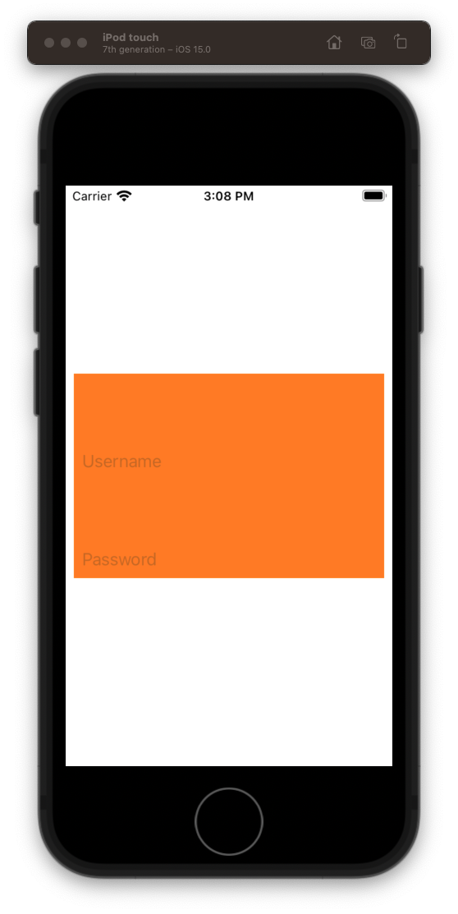
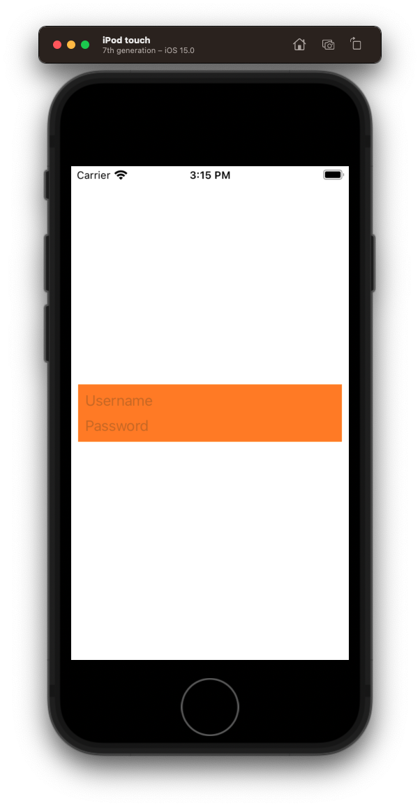
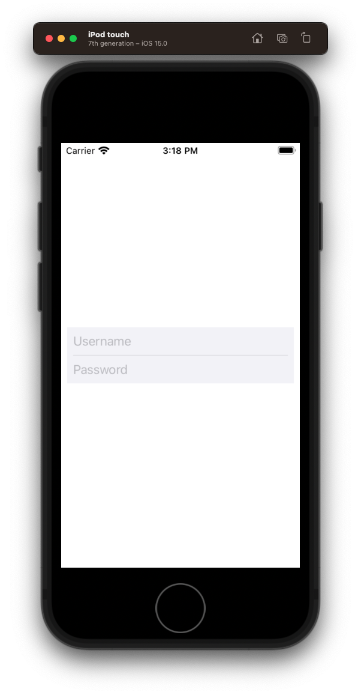
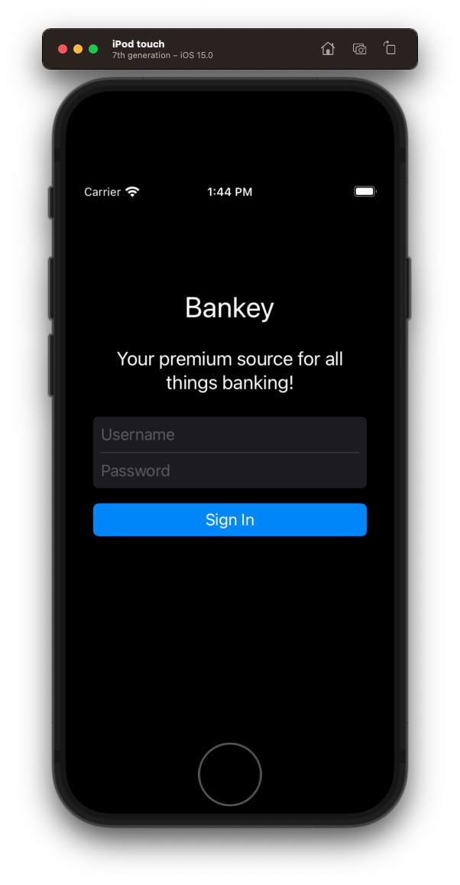

# Login Screen


## Prep for instructor

- Create a fresh clone of the `ios-professional` repos.
- When you create your new project, save it into there.

### Create the UI

- Create a new project `Bankey`
- Remove story boards
  - Code snippets
- Rename `ViewController` to `LoginViewController`
 - Use built in Xcode refactoring  
- Create a `LoginView`
   - Create a `Files` directory
   - Create a `Login` directory

### Plain UIView
Create `LoginView` use snippet

- explain what's going on with `UIVIew`
- Start with just empty `UIView` orange background


**Loginview**

```swift
import Foundation
import UIKit

class LoginView: UIView {
    
    override init(frame: CGRect) {
        super.init(frame: frame)
        
        style()
        layout()
    }
    
    required init?(coder: NSCoder) {
        fatalError("init(coder:) has not been implemented")
    }
    
    override var intrinsicContentSize: CGSize {
        return CGSize(width: 200, height: 200)
    }
}

extension LoginView {
    
    func style() {
        translatesAutoresizingMaskIntoConstraints = false
        backgroundColor = .orange
    }
    
    func layout() {
        
    }
}
```

**LoginViewController**

```swift
//
//  ViewController.swift
//  Test1
//
//  Created by jrasmusson on 2021-09-24.
//

import UIKit

class LoginViewController: UIViewController {

    let loginView = LoginView()
    
    override func viewDidLoad() {
        super.viewDidLoad()
        style()
        layout()
    }
}

extension LoginViewController {
    private func style() {
        loginView.translatesAutoresizingMaskIntoConstraints = false
        
    }
    
    private func layout() {
        view.addSubview(loginView)
        
        NSLayoutConstraint.activate([
            loginView.centerYAnchor.constraint(equalTo: view.centerYAnchor),
            loginView.leadingAnchor.constraint(equalToSystemSpacingAfter: view.leadingAnchor, multiplier: 1),
            view.trailingAnchor.constraint(equalToSystemSpacingAfter: loginView.trailingAnchor, multiplier: 1)
        ])
    }
}
```

### Adding a textfield

Add single `textfield` and delegate

- Comment on how nice it is to access anchors directly compared to view controller

**LoginView**

```swift
class LoginView: UIView {
    
    let usernameTextField = UITextField()
```

```swift
extension LoginView {
    
    func style() {        
        usernameTextField.translatesAutoresizingMaskIntoConstraints = false
        usernameTextField.placeholder = "Username"
        usernameTextField.delegate = self
    }
    
    func layout() {
        addSubview(usernameTextField)
        
        NSLayoutConstraint.activate([
            usernameTextField.topAnchor.constraint(equalToSystemSpacingBelow: topAnchor, multiplier: 1),
            usernameTextField.leadingAnchor.constraint(equalToSystemSpacingAfter: leadingAnchor, multiplier: 1),
            trailingAnchor.constraint(equalToSystemSpacingAfter: usernameTextField.trailingAnchor, multiplier: 1)
        ])
    }
}
```

And the text field delegate.

```swift
// MARK: - UITextFieldDelegate
extension LoginView: UITextFieldDelegate {
    
    func textFieldShouldReturn(_ textField: UITextField) -> Bool {
        usernameTextField.endEditing(true)
        return true
    }
    
    func textFieldShouldEndEditing(_ textField: UITextField) -> Bool {
        if textField.text != "" {
            return true
        } else {
            return false
        }
    }
    
    func textFieldDidEndEditing(_ textField: UITextField) {
    }
}
```


### Embedding in a stack view

Not bad. But these elements would fit nicely in a `UIStackView`. Let's try that.

```swift
class LoginView: UIView {
    
    let stackView = UIStackView()
```

```swift
extension LoginView {
    
    func style() {        
        stackView.translatesAutoresizingMaskIntoConstraints = false
        stackView.axis = .vertical
        stackView.spacing = 8
    }

    func layout() {
        stackView.addArrangedSubview(usernameTextField)
        addSubview(stackView)
        
        // StackView
        NSLayoutConstraint.activate([
            stackView.topAnchor.constraint(equalToSystemSpacingBelow: topAnchor, multiplier: 1),
            stackView.leadingAnchor.constraint(equalToSystemSpacingAfter: leadingAnchor, multiplier: 1),
            trailingAnchor.constraint(equalToSystemSpacingAfter: stackView.trailingAnchor, multiplier: 1),
            bottomAnchor.constraint(equalToSystemSpacingBelow: stackView.bottomAnchor, multiplier: 1)
        ])
    }
```


### Challenge: Add password field

Get students to add `passwordTextField` to view embedded in stackview just like `usernameTextField`.

```swift
let passwordTextField = UITextField()

passwordTextField.translatesAutoresizingMaskIntoConstraints = false
passwordTextField.placeholder = "Password"
passwordTextField.isSecureTextEntry = true
passwordTextField.delegate = self

stackView.addArrangedSubview(passwordTextField)
```

Good. One more addition. To make our password give up the keyboard (resign first responder) we will signal end editting.

```swift
func textFieldShouldReturn(_ textField: UITextField) -> Bool {
    passwordTextField.endEditing(true)
    return true
}
```



## Getting rid of intrinsic content size

Now that we have our elements embedded in a stack view, and each has their own intrinsic content size, our view itself doesn't need to override. Can delete.

Explain what intrinisc content size is, and how it works. To learn more about it and autolayout in general consider taking my [Auto Layout Course](https://www.udemy.com/course/level-up-in-swift/?referralCode=BBCF1340150A86E7F6C4).



## Add a divider

Add a one point divider like this.

```swift
let dividerView = UIView()

dividerView.translatesAutoresizingMaskIntoConstraints = false
dividerView.backgroundColor = .secondarySystemFill

stackView.addArrangedSubview(dividerView)

dividerView.heightAnchor.constraint(equalToConstant: 1).isActive = true
```

Explain that last constraint `isActive` and how the array works.

Let's also change our background color.

```swift
backgroundColor = .secondarySystemBackground
```



## Round the corners

```swift
layer.cornerRadius = 5
clipsToBounds = true
```	

At this point our `LoginView` should look like this.
	
```swift
//
//  LoginView.swift
//  Test1
//
//  Created by jrasmusson on 2021-09-24.
//

import Foundation
import UIKit

class LoginView: UIView {
    
    let stackView = UIStackView()
    let usernameTextField = UITextField()
    let passwordTextField = UITextField()
    let dividerView = UIView()
    
    override init(frame: CGRect) {
        super.init(frame: frame)
        
        style()
        layout()
    }
    
    required init?(coder: NSCoder) {
        fatalError("init(coder:) has not been implemented")
    }
}

extension LoginView {
    
    func style() {
        translatesAutoresizingMaskIntoConstraints = false
        backgroundColor = .secondarySystemBackground
        
        stackView.translatesAutoresizingMaskIntoConstraints = false
        stackView.axis = .vertical
        stackView.spacing = 8
        
        usernameTextField.translatesAutoresizingMaskIntoConstraints = false
        usernameTextField.placeholder = "Username"
        usernameTextField.delegate = self
        
        dividerView.translatesAutoresizingMaskIntoConstraints = false
        dividerView.backgroundColor = .secondarySystemFill

        passwordTextField.translatesAutoresizingMaskIntoConstraints = false
        passwordTextField.placeholder = "Password"
        passwordTextField.isSecureTextEntry = true
        passwordTextField.delegate = self
        
        layer.cornerRadius = 5
        clipsToBounds = true
    }
    
    func layout() {
        stackView.addArrangedSubview(usernameTextField)
        stackView.addArrangedSubview(dividerView)
        stackView.addArrangedSubview(passwordTextField)
        addSubview(stackView)
        
        // StackView
        NSLayoutConstraint.activate([
            stackView.topAnchor.constraint(equalToSystemSpacingBelow: topAnchor, multiplier: 1),
            stackView.leadingAnchor.constraint(equalToSystemSpacingAfter: leadingAnchor, multiplier: 1),
            trailingAnchor.constraint(equalToSystemSpacingAfter: stackView.trailingAnchor, multiplier: 1),
            bottomAnchor.constraint(equalToSystemSpacingBelow: stackView.bottomAnchor, multiplier: 1)
        ])
        
        dividerView.heightAnchor.constraint(equalToConstant: 1).isActive = true
    }
}

// MARK: - UITextFieldDelegate
extension LoginView: UITextFieldDelegate {
    
    func textFieldShouldReturn(_ textField: UITextField) -> Bool {
        usernameTextField.endEditing(true)
        passwordTextField.endEditing(true)
        return true
    }
    
    func textFieldShouldEndEditing(_ textField: UITextField) -> Bool {
        if textField.text != "" {
            return true
        } else {
            return false
        }
    }
    
    func textFieldDidEndEditing(_ textField: UITextField) {
    }
}
```


### SignIn Button Challenge

Switch to `LoginViewController`. Here is the sign-in button we want to add.

**LoginViewController**

```swift
let signInButton = UIButton(type: .system)

signInButton.translatesAutoresizingMaskIntoConstraints = false
signInButton.configuration = .filled()
signInButton.configuration?.imagePadding = 8 // for indicator spacing
signInButton.setTitle("Sign In", for: [])
signInButton.addTarget(self, action: #selector(signInTapped), for: .primaryActionTriggered)

view.addSubview(signInButton)

// MARK: Actions
extension LoginViewController {
    @objc func signInTapped(sender: UIButton) {
    }
}
```

See if you can position this button x2 multiplers beneath the `loginView` and the same width. 

```swift
// Button
NSLayoutConstraint.activate([
    signInButton.topAnchor.constraint(equalToSystemSpacingBelow: loginView.bottomAnchor, multiplier: 2),
    signInButton.leadingAnchor.constraint(equalTo: loginView.leadingAnchor),
    signInButton.trailingAnchor.constraint(equalTo: loginView.trailingAnchor),
])
```


### Handle login

Next, we want to hook our button up so when users click it, we check the username and password, and then add a spinning indicator to show we are checking the user credentials and logging in.

#### Error message challenge

Here is the error message with want to add. 

**LoginViewController**

```swift
    let errorMessageLabel = UILabel()
```

```swift
    private func style() {
        errorMessageLabel.translatesAutoresizingMaskIntoConstraints = false
        errorMessageLabel.textAlignment = .center
        errorMessageLabel.textColor = .systemRed
        errorMessageLabel.numberOfLines = 0
        errorMessageLabel.isHidden = true
    }
```

- Talk about colors and `systemRed`.
- [HIG Color](https://developer.apple.com/design/human-interface-guidelines/ios/visual-design/color/)

See if you can lay it out x2 system spaces beneath the sign in button. Same width as the `loginView`.

```swift
    private func layout() {
        view.addSubview(errorMessageLabel)
```

```swift
    private func layout() {
        
        // Error message
        NSLayoutConstraint.activate([
            errorMessageLabel.topAnchor.constraint(equalToSystemSpacingBelow: signInButton.bottomAnchor, multiplier: 2),
            errorMessageLabel.leadingAnchor.constraint(equalTo: loginView.leadingAnchor),
            errorMessageLabel.trailingAnchor.constraint(equalTo: loginView.trailingAnchor)
        ])
    }
```

#### Logging in

Next let's login.

```swift
    var username: String? {
        return loginView.usernameTextField.text
    }

    var password: String? {
        return loginView.passwordTextField.text
    }
```

```swift
    private func style() {
        signInButton.configuration?.imagePadding = 8 // for indicator spacing
        signInButton.addTarget(self, action: #selector(signInTapped), for: .primaryActionTriggered)
    }
```

When we login, we want to display the error message if:

- username and password are blank
- show spinning indicator if valid

```swift
// MARK: Actions
extension LoginViewController {
    @objc func signInTapped(sender: UIButton) {
        errorMessageLabel.isHidden = true
        login()
    }
    
    private func login() {
        guard let username = username, let password = password else {
            assertionFailure("Username / password should never be nil")
            return
        }

        if username.isEmpty || password.isEmpty {
            configureView(withMessage: "Username / password cannot be blank")
            return
        }
        
        if username == "Kevin" && password == "Welcome" {
            signInButton.configuration?.showsActivityIndicator = true
        } else {
            configureView(withMessage: "Incorrect username / password")
        }
    }
    
    private func configureView(withMessage message: String) {
        errorMessageLabel.isHidden = false
        errorMessageLabel.text = message
    }
}
```

- Discuss `assertionFailure`.
- Discuss [named parameters](https://github.com/jrasmusson/level-up-swift/tree/master/2-functions)
- Discuss activity indicator and image spacing
- How to toggle keyboard (Shift+Command+K)


### Adding titles

- Show students labels we'd like to add.
- Setup up for them as follows


**LoginViewController**

```swift
let titleLabel = UILabel()
let subtitleLabel = UILabel()

titleLabel.translatesAutoresizingMaskIntoConstraints = false
titleLabel.textAlignment = .center
titleLabel.font = UIFont.preferredFont(forTextStyle: .largeTitle)
titleLabel.adjustsFontForContentSizeCategory = true
titleLabel.text = "Bankey"

subtitleLabel.translatesAutoresizingMaskIntoConstraints = false
subtitleLabel.textAlignment = .center
subtitleLabel.font = UIFont.preferredFont(forTextStyle: .title3)
subtitleLabel.adjustsFontForContentSizeCategory = true
subtitleLabel.numberOfLines = 0
subtitleLabel.text = "Your premium source for all things banking!"
```

- Discuss varable ordering in file and why you put at the top
- Discuss [dynamic fonts](https://github.com/jrasmusson/ios-starter-kit/tree/master/basics/DynamicFont)

#### Title challenge

Challenge students to layout title and subtitle. Don't tell them how to do it. Just say subtitle x3 system spaces above login view, and title x3 system spaces above subtitle. Way width as `loginView`.

```swift
private func layout() {
    view.addSubview(titleLabel)
    view.addSubview(subtitleLabel)

    // Title
    NSLayoutConstraint.activate([
        subtitleLabel.topAnchor.constraint(equalToSystemSpacingBelow: titleLabel.bottomAnchor, multiplier: 3),
        titleLabel.centerXAnchor.constraint(equalTo: view.centerXAnchor)
    ])
    
    // Subtitle
    NSLayoutConstraint.activate([
        loginView.topAnchor.constraint(equalToSystemSpacingBelow: subtitleLabel.bottomAnchor, multiplier: 3),
        subtitleLabel.leadingAnchor.constraint(equalTo: loginView.leadingAnchor),
        subtitleLabel.trailingAnchor.constraint(equalTo: loginView.trailingAnchor)
    ])
}
```

- Let them try. Show what you want.

- Discuss how to keep things groupe and sometimes working from the top vs sometimes working from the middle
- Discuss width, vs center, vs pinning to the sides

```swift
// Subtitle - centerX - multi-line
NSLayoutConstraint.activate([
    loginView.topAnchor.constraint(equalToSystemSpacingBelow: subtitleLabel.bottomAnchor, multiplier: 3),
    subtitleLabel.centerXAnchor.constraint(equalTo: view.centerXAnchor)
])

// Subtitle - width - alignment off
NSLayoutConstraint.activate([
    loginView.topAnchor.constraint(equalToSystemSpacingBelow: subtitleLabel.bottomAnchor, multiplier: 3),
    subtitleLabel.widthAnchor.constraint(equalTo: loginView.widthAnchor)
])
    
// Subtitle - pinning leading trailing
NSLayoutConstraint.activate([
    loginView.topAnchor.constraint(equalToSystemSpacingBelow: subtitleLabel.bottomAnchor, multiplier: 3),
    subtitleLabel.leadingAnchor.constraint(equalTo: loginView.leadingAnchor),
    subtitleLabel.trailingAnchor.constraint(equalTo: loginView.trailingAnchor)
])
```

- Point here is all three work. Some just work better than others and you need to experiment. In this case third option works best.


- Demo Dark mode and what they get for free with dynamic fonts (Control+Shift+A)





## Save your work

Let's now save your work in your repos.

### gitignore

There is an annoying file `.DS_Store` we would rather not include in our repos. We can ignore it by adding it to our `.gitignore`.

```
> cd ios-professional
> git status
> vi .gitignore

## User settings
xcuserdata/
.DS_Store

> git status (.DS_Store should be gone)
```

Now we can add and save our repos.

```
> cd ios-professional
> git add .
> git commit -m "Add login screen"
> git push
> git log
```

Congratultions 🎉. You have now built your own login screen.


## Full Source

**LoginViewController**

```swift
//
//  ViewController.swift
//  Bankey
//
//  Created by jrasmusson on 2021-09-23.
//

import UIKit

class LoginViewController: UIViewController {

    let titleLabel = UILabel()
    let subtitleLabel = UILabel()
    
    let loginView = LoginView()
    let signInButton = UIButton(type: .system)
    let errorMessageLabel = UILabel()
    
    var username: String? {
        return loginView.usernameTextField.text
    }

    var password: String? {
        return loginView.passwordTextField.text
    }

    override func viewDidLoad() {
        super.viewDidLoad()
        style()
        layout()
    }
}

extension LoginViewController {
    
    private func style() {
        view.backgroundColor = .systemBackground
        
        titleLabel.translatesAutoresizingMaskIntoConstraints = false
        titleLabel.textAlignment = .center
        titleLabel.font = UIFont.preferredFont(forTextStyle: .largeTitle)
        titleLabel.adjustsFontForContentSizeCategory = true
        titleLabel.text = "Bankey"

        subtitleLabel.translatesAutoresizingMaskIntoConstraints = false
        subtitleLabel.textAlignment = .center
        subtitleLabel.font = UIFont.preferredFont(forTextStyle: .title3)
        subtitleLabel.adjustsFontForContentSizeCategory = true
        subtitleLabel.numberOfLines = 0
        subtitleLabel.text = "Your premium source for all things banking!"

        loginView.translatesAutoresizingMaskIntoConstraints = false

        signInButton.translatesAutoresizingMaskIntoConstraints = false
        signInButton.configuration = .filled()
        signInButton.configuration?.imagePadding = 8 // for indicator spacing
        signInButton.setTitle("Sign In", for: [])
        signInButton.addTarget(self, action: #selector(signInTapped), for: .primaryActionTriggered)
        
        errorMessageLabel.translatesAutoresizingMaskIntoConstraints = false
        errorMessageLabel.textAlignment = .center
        errorMessageLabel.textColor = .systemRed
        errorMessageLabel.numberOfLines = 0
        errorMessageLabel.isHidden = true
    }
    
    private func layout() {
        view.addSubview(titleLabel)
        view.addSubview(subtitleLabel)
        view.addSubview(loginView)
        view.addSubview(signInButton)
        view.addSubview(errorMessageLabel)

        // Title
        NSLayoutConstraint.activate([
            subtitleLabel.topAnchor.constraint(equalToSystemSpacingBelow: titleLabel.bottomAnchor, multiplier: 3),
            titleLabel.centerXAnchor.constraint(equalTo: view.centerXAnchor)
        ])
        
        // Subtitle
        NSLayoutConstraint.activate([
            loginView.topAnchor.constraint(equalToSystemSpacingBelow: subtitleLabel.bottomAnchor, multiplier: 3),
            subtitleLabel.widthAnchor.constraint(equalTo: loginView.widthAnchor)
        ])
        
        // LoginView
        NSLayoutConstraint.activate([
            loginView.leadingAnchor.constraint(equalToSystemSpacingAfter: view.leadingAnchor, multiplier: 2),
            view.trailingAnchor.constraint(equalToSystemSpacingAfter: loginView.trailingAnchor, multiplier: 2),
            view.centerYAnchor.constraint(equalTo: loginView.centerYAnchor),
        ])
        
        // Button
        NSLayoutConstraint.activate([
            signInButton.topAnchor.constraint(equalToSystemSpacingBelow: loginView.bottomAnchor, multiplier: 2),
            signInButton.leadingAnchor.constraint(equalTo: loginView.leadingAnchor),
            signInButton.trailingAnchor.constraint(equalTo: loginView.trailingAnchor),
        ])
        
        // Error message
        NSLayoutConstraint.activate([
            errorMessageLabel.topAnchor.constraint(equalToSystemSpacingBelow: signInButton.bottomAnchor, multiplier: 2),
            errorMessageLabel.leadingAnchor.constraint(equalTo: loginView.leadingAnchor),
            errorMessageLabel.trailingAnchor.constraint(equalTo: loginView.trailingAnchor)
        ])
    }
}

// MARK: Actions
extension LoginViewController {
    @objc func signInTapped(sender: UIButton) {
        errorMessageLabel.isHidden = true
        login()
    }
    
    private func login() {
        guard let username = username, let password = password else {
            assertionFailure("Username / password should never be nil")
            return
        }

        if username.isEmpty || password.isEmpty {
            configureView(withMessage: "Username / password cannot be blank")
            return
        }
        
        if username == "Kevin" && password == "Welcome" {
            print("Welcome!")
            signInButton.configuration?.showsActivityIndicator = true
        } else {
            configureView(withMessage: "Incorrect username / password")
        }
    }
    
    private func configureView(withMessage message: String) {
        errorMessageLabel.isHidden = false
        errorMessageLabel.text = message
    }
}
```

**LoginView**

```swift
//
//  LoginView.swift
//  Test1
//
//  Created by jrasmusson on 2021-09-24.
//

import Foundation
import UIKit

class LoginView: UIView {
    
    let stackView = UIStackView()
    let usernameTextField = UITextField()
    let passwordTextField = UITextField()
    let dividerView = UIView()
    
    override init(frame: CGRect) {
        super.init(frame: frame)
        
        style()
        layout()
    }
    
    required init?(coder: NSCoder) {
        fatalError("init(coder:) has not been iamplemented")
    }
}

extension LoginView {
    
    func style() {
        translatesAutoresizingMaskIntoConstraints = false
        backgroundColor = .secondarySystemBackground
        
        stackView.translatesAutoresizingMaskIntoConstraints = false
        stackView.axis = .vertical
        stackView.spacing = 8
        
        usernameTextField.translatesAutoresizingMaskIntoConstraints = false
        usernameTextField.placeholder = "Username"
        usernameTextField.delegate = self
        
        dividerView.translatesAutoresizingMaskIntoConstraints = false
        dividerView.backgroundColor = .secondarySystemFill

        passwordTextField.translatesAutoresizingMaskIntoConstraints = false
        passwordTextField.placeholder = "Password"
        passwordTextField.isSecureTextEntry = true
        passwordTextField.delegate = self
        
        layer.cornerRadius = 5
        clipsToBounds = true
    }
    
    func layout() {
        stackView.addArrangedSubview(usernameTextField)
        stackView.addArrangedSubview(dividerView)
        stackView.addArrangedSubview(passwordTextField)
        addSubview(stackView)
        
        // StackView
        NSLayoutConstraint.activate([
            stackView.topAnchor.constraint(equalToSystemSpacingBelow: topAnchor, multiplier: 1),
            stackView.leadingAnchor.constraint(equalToSystemSpacingAfter: leadingAnchor, multiplier: 1),
            trailingAnchor.constraint(equalToSystemSpacingAfter: stackView.trailingAnchor, multiplier: 1),
            bottomAnchor.constraint(equalToSystemSpacingBelow: stackView.bottomAnchor, multiplier: 1)
        ])
        
        dividerView.heightAnchor.constraint(equalToConstant: 1).isActive = true
    }
}

// MARK: - UITextFieldDelegate
extension LoginView: UITextFieldDelegate {
    
    func textFieldShouldReturn(_ textField: UITextField) -> Bool {
        usernameTextField.endEditing(true)
        passwordTextField.endEditing(true)
        return true
    }
    
    func textFieldShouldEndEditing(_ textField: UITextField) -> Bool {
        if textField.text != "" {
            return true
        } else {
            return false
        }
    }
    
    func textFieldDidEndEditing(_ textField: UITextField) {
    }
}
```

### Level Up

- [HIG Color](https://developer.apple.com/design/human-interface-guidelines/ios/visual-design/color/)
- [Apple UI Element Colors](https://developer.apple.com/documentation/uikit/uicolor/ui_element_colors)
- [Apple Design Resources](https://developer.apple.com/design/resources/)
- [WWDC What's new in iOS](https://developer.apple.com/videos/play/wwdc2019/808/)
- [Argument Labels in Swift](https://github.com/jrasmusson/level-up-swift/tree/master/2-functions)


