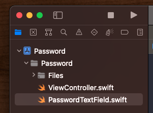
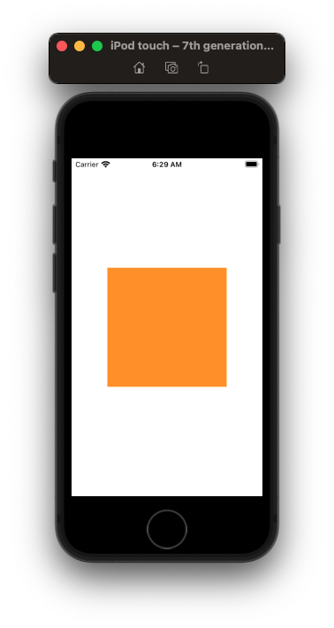

# Creating the PasswordTextField


## Challenge 🕹

- How would you lay this out?
- Grab a piece of paper and see if you can't draw out
 - The elements needed
 - Auto layout constraints needed to layout and align
 - Along with anything else you feel you may need to build this custom component

Don't worry about the interactions - we'll cover that later. Good luck!

## New project

- Create a new UIKit project called `Password`

## Creating the view

- Everything in UIKit is a view
- So when it comes to creating a custom control like this, a good place to start is with a brand new view.

Create a new view called `PasswordTextField`



And let's start off with something like this.

**PasswordTextField**

```swift
import UIKit

class PasswordTextField: UIView {
    
    override init(frame: CGRect) {
        super.init(frame: frame)
        
        style()
        layout()
    }
    
    required init?(coder: NSCoder) {
        fatalError("init(coder:) has not been implemented")
    }
    
    override var intrinsicContentSize: CGSize {
        return CGSize(width: 200, height: 200)
    }
}

extension PasswordTextField {
    
    func style() {
        translatesAutoresizingMaskIntoConstraints = false
        backgroundColor = .systemOrange
    }
    
    func layout() {
        
    }
}
```

Simple view. Just going to be a 200x200 square for now. But let's add it to our view controller, just to create our canvas, and start building our password control from there.


**ViewController**

```swift
import UIKit

class ViewController: UIViewController {
    
    let newPasswordTextField = PasswordTextField()
    
    override func viewDidLoad() {
        super.viewDidLoad()
        style()
        layout()
    }
}

extension ViewController {
    func style() {
        newPasswordTextField.translatesAutoresizingMaskIntoConstraints = false
    }
    
    func layout() {
        view.addSubview(newPasswordTextField)
        
        NSLayoutConstraint.activate([
            newPasswordTextField.centerXAnchor.constraint(equalTo: view.centerXAnchor),
            newPasswordTextField.centerYAnchor.constraint(equalTo: view.centerYAnchor),
        ])
    }
}
```



OK. Now we are ready to think about how to transform this orange box into a cool looking password text field.

Let's look at a couple of options on how we could layout this design.


## Doing the layout

Grab your piece of paper where you did you initial design earlier, and reference it as we go through some different design options here (note to self - pull out iPad and draw).

- first go over the elements
- then discuss text field with left and right images/buttons
- divider
- error label

Think it would be easiest if we layed it out like this.


Now don't worry if your hand drawn images doesn't look exactly like this. I got here after some iterations and tweaking.

But I choose this layout because I felt I needed a lot of control over where every elements was placed. Let's lay it out.

### Adding the lockImageView

**PasswordTextField**

```swift
class PasswordTextField: UIView {
    
    let lockImageView = UIImageView(image: UIImage(systemName: "lock.fill"))

    func style() {        
        lockImageView.translatesAutoresizingMaskIntoConstraints = false

    func layout() {
        addSubview(lockImageView)

        // lock
        NSLayoutConstraint.activate([
            lockImageView.topAnchor.constraint(equalTo: topAnchor),
            lockImageView.leadingAnchor.constraint(equalTo: leadingAnchor),
        ])
```


OK - not a bad start. Let's next work in the text field.

### Adding the textField

The text field is the crux of this view. It should really be the center, and these images and buttons should center off it. Let's pin it to the top, and then adjust our image view so it aligns along the y-axis in the middle.

**PasswordTextField**

```swift
let textField = UITextField()
let placeHolderText: String = "New password"

textField.translatesAutoresizingMaskIntoConstraints = false
textField.isSecureTextEntry = false // true
textField.placeholder = placeHolderText
textField.delegate = self
textField.keyboardType = .asciiCapable
textField.attributedPlaceholder = NSAttributedString(string:placeHolderText,
                                                     attributes: [NSAttributedString.Key.foregroundColor: UIColor.secondaryLabel])

addSubview(textField)

// lock
NSLayoutConstraint.activate([
    lockImageView.centerYAnchor.constraint(equalTo: textField.centerYAnchor),
    lockImageView.leadingAnchor.constraint(equalTo: leadingAnchor),
])
    
// textfield
NSLayoutConstraint.activate([
    textField.topAnchor.constraint(equalTo: topAnchor),
    textField.leadingAnchor.constraint(equalToSystemSpacingAfter: lockImageView.trailingAnchor, multiplier: 1),
])
```


OK not bad. Let's make one more little adjustment. Let's make this text field a little more reusable by passing in that `placeHolder` text.

**PasswordTextField**

```swift
let placeHolderText: String
    
init(placeHolderText: String) {
    self.placeHolderText = placeHolderText
    
    super.init(frame: .zero)
    
    style()
    layout()
}
```

**ViewController**

```swift
class ViewController: UIViewController { 
    let newPasswordTextField = PasswordTextField(placeHolderText: "New password")
```

- Discussion. Talk about the initialization of variables in constructors.

### Challenge 🕹 - Adding the eye button

See if you can add a plain button to the right of the text field.

Call it

`let eyeButton = UIButton(type: .custom)`

Don't worry about adding images or giving it a target action or anything. Just practice your auto layout, and see if you can place a button spaced just off the wall just like our `lockImageView`, centered along the y-axis to the `textField`.

### Solution ✅

```swift
let eyeButton = UIButton(type: .custom)

eyeButton.translatesAutoresizingMaskIntoConstraints = false
eyeButton.setImage(UIImage(systemName: "eye.circle"), for: .normal)
eyeButton.setImage(UIImage(systemName: "eye.slash.circle"), for: .selected)
eyeButton.addTarget(self, action: #selector(togglePasswordView), for: .touchUpInside)

addSubview(eyeButton)

// eye
NSLayoutConstraint.activate([
    eyeButton.centerYAnchor.constraint(equalTo: textField.centerYAnchor),
    eyeButton.leadingAnchor.constraint(equalToSystemSpacingAfter: textField.trailingAnchor, multiplier: 1),
    eyeButton.trailingAnchor.constraint(equalTo: trailingAnchor)
])

// MARK: - Actions
extension PasswordTextField {
    @objc func togglePasswordView(_ sender: Any) {
        textField.isSecureTextEntry.toggle()
        eyeButton.isSelected.toggle()
    }
}
```


### Fixing the CHCR

OK not bad. Got some image compression going on here. If you were working with a junior developer and they asked you what was going on here what would you say?

- Explain CHCR.
- Explain what is going on here.
- Share the solution.

```swift
// CHCR
lockImageView.setContentHuggingPriority(UILayoutPriority.defaultHigh, for: .horizontal)
textField.setContentHuggingPriority(UILayoutPriority.defaultLow, for: .horizontal)
eyeButton.setContentHuggingPriority(UILayoutPriority.defaultHigh, for: .horizontal)
```


### Challenge 🕹 Adding the divider

See if you can add this `dividerView` as a `UIView`.

Make it:

- `1pt` height
- Flush `leading` and `trailing` to edge of view
- `8pts` (1x) underneath `textField`
-  `backgroundColor = separator`


### Solution ✅

**PasswordTextField**

```swift
let dividerView = UIView()

dividerView.translatesAutoresizingMaskIntoConstraints = false
dividerView.backgroundColor = .separator

addSubview(dividerView)

// divider
NSLayoutConstraint.activate([
    dividerView.leadingAnchor.constraint(equalTo: leadingAnchor),
    dividerView.trailingAnchor.constraint(equalTo: trailingAnchor),
    dividerView.heightAnchor.constraint(equalToConstant: 1),
    bottomAnchor.constraint(equalToSystemSpacingBelow: dividerView.topAnchor, multiplier: 1)
])

override var intrinsicContentSize: CGSize {
    return CGSize(width: 200, height: 50)
}
```

### Choosing the right colors 🌈

Explain how you want to use semantically defined colors over system colors when styling your elements and controls.

See [this](https://github.com/jrasmusson/ios-starter-kit/blob/master/basics/Color/README.md) color guide.

### Challenge 🕹 Adding the error label

See if you can add the error label:

- `4pts` beneath the `dividerView`
- Flush `leading` and `trailing` edges
- Preferred font `footnote`
- `textColor` = `systemRed`

### Solution ✅

## Embedding in a stack view

OK this is looking pretty good. But looking ahead a bit it would be nice if we could embed this in a stack view.

Stack views are nice because this give you nice equal spacing while minimizing the number of required auto layout constraints.

### Links that help

- [Colors](https://github.com/jrasmusson/ios-starter-kit/blob/master/basics/Color/README.md)

