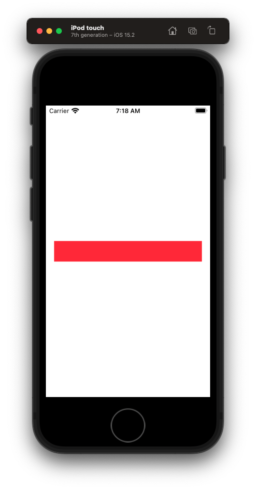
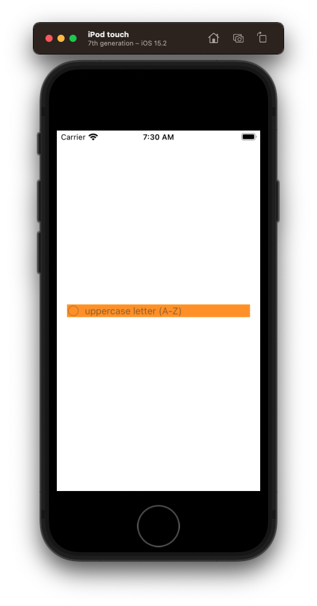

# PasswordStatusView

## Challenge 🎨

How would you design this view?


- Think about how you would break it down
- What elements you would need or use
- How you would put it all together

Grab some paper and pen. Spend five minutes thinking about this design. Come back, and we'll go over some designs together.

Demo options with iPad.

## Solution ✅

One solution to this design would be to leverage a stack view for the `PasswordStatusView`.


Which in turn would be made up of a label, along with several instances of small `PasswordCriteria` views.


Advantage of this design is:

- leverages stack views
- requires few constraints
- very configurable

Let's start first with the smaller of the views - the password criteria.

## Creating the PasswordCriteriaView

- Create a new group called `PasswordStatusView`
- Create a new file in that dir called `PasswordCriteriaView`


- Use our code snippet
- Set background color and give size of

**PasswordCriteriaView**

```swift
override var intrinsicContentSize: CGSize {
    return CGSize(width: 200, height: 40)
}
```

Then let's comment out the `newPasswordTextField` in our stack and instead add the `criteriaView` to our `ViewController`.

**ViewController**

```swift
class ViewController: UIViewController {
    let stackView = UIStackView()
    let newPasswordTextField = PasswordTextField(placeHolderText: "New password")
    let criteriaView = PasswordCriteriaView()

    criteriaView.translatesAutoresizingMaskIntoConstraints = false
    
    //        stackView.addArrangedSubview(newPasswordTextField)
    stackView.addArrangedSubview(criteriaView)
```


Good place to start. A simply view sized `200x40`. Let's start adding elements. Starting with the stack view.

### Challenge 🕹 Add a stack view to PasswordCriteriaView

We know we are going to base this layout on a stack view. So let's start by adding a stack view to our `PasswordCriteriaView` and then doing our layout from there.

See if you can add a stack view to `PasswordCriteriaView`.

- Call it `let stackView = UIStackView()`
- Pin it flush to the `top`, `leading`, `trailing`, `bottom` edges.
- Axis `.vertical` (default)
- Give it `spacing = 8`

### Solution ✅

**PasswordCriteriaView**

```swift
let stackView = UIStackView()

stackView.translatesAutoresizingMaskIntoConstraints = false
stackView.spacing = 8

addSubview(stackView)

// Stack
NSLayoutConstraint.activate([
    stackView.topAnchor.constraint(equalTo: topAnchor),
    stackView.leadingAnchor.constraint(equalTo: leadingAnchor),
    stackView.trailingAnchor.constraint(equalTo: trailingAnchor),
    stackView.bottomAnchor.constraint(equalTo: bottomAnchor)
])

```

No change in layout at this point. Could optionally set `backgroundColor` on `stackView` to verify sizing.

```swift
stackView.backgroundColor = .systemRed
```



But once confirmed our stack view is instead there we can remove and stick with our view background of orange.

### Adding an image view

Working our way from left to rights, let's add our `imageView`.

**PasswordCriteriaView**

```swift
let imageView = UIImageView()

imageView.translatesAutoresizingMaskIntoConstraints = false
imageView.image = UIImage(systemName: "circle")!.withTintColor(.tertiaryLabel, renderingMode: .alwaysOriginal)

stackView.addArrangedSubview(imageView)

// Image
NSLayoutConstraint.activate([
    imageView.heightAnchor.constraint(equalTo: imageView.widthAnchor)
])
```


What's happening here is we have an image in a stackView with it's default:

- `distribution = .fill`

This is one of the strange/neat/confusing things about stack views. They always want to stretch and fill.

Discussion: Why not add height and width constraints

- Would be temping to fix now by adding height and width constraints (20x20). Why not?
- Because we always want to size things as naturally as we can first, and only resort to hard constraints when necessary.
- I know this image is been stretched - because it is the only thing in the stack view.
- Let's add a label, see what things look like after that, and then decide if we need to take more drastic action.

### Challenge 🕹 Adding the label


Let's see if you can add the label that is going to sit beside our image.

- Call it `let label = UILabel()`.
- Give it a preferred font of `subheadline`
- text color `secondaryLabel`
- some text `uppercase letter (A-Z)`

Should require any constraints. Simply adding to stack view.

### Solution

**PasswordCriteriaView**

```swift
let label = UILabel()

label.translatesAutoresizingMaskIntoConstraints = false
label.font = .preferredFont(forTextStyle: .subheadline)
label.textColor = .secondaryLabel
label.text = "uppercase letter (A-Z)"

stackView.addArrangedSubview(label)
```


OK not bad. Much better. But I still suspect that my image is bigger than it ought to be. And if we reason about this we realize we haven't told our image or label who should stretch and who should hug. In other words there is the potential ambiguity.

There technically isn't any ambiguity because we are in a stack view with the property stretch to fill.

But watch what happens if we explicitly set our Content-Hugging-Compression-Resistance or CHCR.

```swift
// CHCR
imageView.setContentHuggingPriority(UILayoutPriority.defaultHigh, for: .horizontal)
label.setContentHuggingPriority(UILayoutPriority.defaultLow, for: .horizontal)
```



🎉 Voila. Ambiguity gone. Image is respecting its intrinsic content size of (20x20). All without requiring any hard coded width and height constraints.

### Filling in the rest

OK. At this point our criteria view is layed out. Let's now just add some helper functions to represent the other image states and a constructor to set some text.

**PasswordCriteriaView**

```swift
let checkmarkImage = UIImage(systemName: "checkmark.circle")!.withTintColor(.systemGreen, renderingMode: .alwaysOriginal)
let xmarkImage = UIImage(systemName: "xmark.circle")!.withTintColor(.systemRed, renderingMode: .alwaysOriginal)
let circleImage = UIImage(systemName: "circle")!.withTintColor(.tertiaryLabel, renderingMode: .alwaysOriginal)
    
var isCriteriaMet: Bool = false {
    didSet {
        if isCriteriaMet {
            imageView.image = checkmarkImage
        } else {
            imageView.image = xmarkImage
        }
    }
}

func reset() {
    isCriteriaMet = false
    imageView.image = circleImage
}

init(text: String) {
    super.init(frame: .zero)
    
    label.text = text
    
    style()
    layout()
}
```

- Let's remove the hard coded text on the label.
- Fix our compliation error.

**ViewController**

```swift
let criteriaView = PasswordCriteriaView(text: "uppercase letter (A-Z")
```

And we're good to go. Let's save our work.


### Save your work 💾

```
> git add .
> git commit -m "feat: add password criteria view"
```