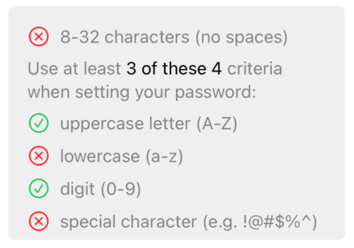
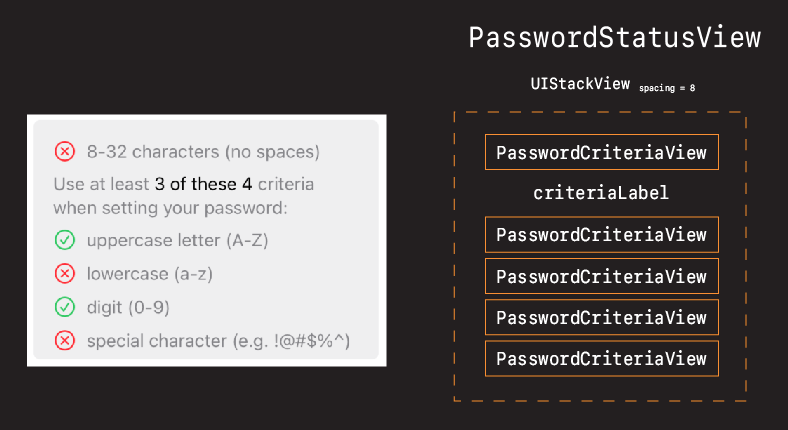

# PasswordStatusView

## Challenge 🎨

How would you design this view?



- Think about how you would break it down
- What elements you would need or use
- How you would put it all together

Grab some paper and pen. Spend five minutes thinking about this design. Come back, and we'll go over some designs together.

Demo options with iPad.

## Solution ✅

One solution to this design would be to leverage a stack view for the `PasswordStatusView`.



Which in turn would be made up of a label, along with several instances of small `PasswordCriteria` views.


Advantage of this design is:

- leverages stack views
- requires few constraints
- very configurable

Let's start first with the smaller of the views - the password criteria.

## Creating the PasswordCriteriaView

- Create a new view `PasswordCriteriaView`
- Use our code snippet
- Give size of

**PasswordCriteriaView**

```swift
override var intrinsicContentSize: CGSize {
    return CGSize(width: UIView.noIntrinsicMetric, height: 40)
}
```

### Challenge 🕹 Add a stack view

See if you can add a stack view to this view.

- pin it fully to the top, leading, trailing, bottom edges with a multiplier of zero - completely flush.
- `spacing = 8`

### Solution ✅

**PasswordCriteriaView**

```swift
let stackView = UIStackView()

stackView.translatesAutoresizingMaskIntoConstraints = false
stackView.spacing = 8

addSubview(stackView)

// Stack
NSLayoutConstraint.activate([
    stackView.topAnchor.constraint(equalTo: topAnchor),
    stackView.leadingAnchor.constraint(equalTo: leadingAnchor),
    stackView.trailingAnchor.constraint(equalTo: trailingAnchor),
    stackView.bottomAnchor.constraint(equalTo: bottomAnchor)
])

```

### Adding an image view

Let's add our `imageView` in there first with only one constraint - the width must equal the height.

**PasswordCriteriaView**

```swift
let imageView = UIImageView()

imageView.translatesAutoresizingMaskIntoConstraints = false
imageView.image = UIImage(systemName: "circle")!.withTintColor(.tertiaryLabel, renderingMode: .alwaysOriginal)

stackView.addArrangedSubview(imageView)

// Image
NSLayoutConstraint.activate([
    imageView.heightAnchor.constraint(equalTo: imageView.widthAnchor)
])
```

OK not bad.

### Challenge 🕹 Adding the label

Let's see if you can add the label that is going to sit beside our image.

- Call it `label`.
- Give it a preferred font of `subheadline`
- text color `secondaryLabel`
- some text `uppercase letter (A-Z)`

### Solution

**PasswordCriteriaView**

```swift
let label = UILabel()
label.translatesAutoresizingMaskIntoConstraints = false
label.font = .preferredFont(forTextStyle: .subheadline)
label.textColor = .secondaryLabel

stackView.addArrangedSubview(label)
```

### Fixing the stretch

OK what's going on here. Remember how to fix? This is CHCR.

We fix this by removing the ambiguity and telling auto layout which elements should hug (`imageView`) and which should stretch (`label`).

```swift
// CHCR
imageView.setContentHuggingPriority(UILayoutPriority.defaultHigh, for: .horizontal)
label.setContentHuggingPriority(UILayoutPriority.defaultLow, for: .horizontal)
```

### Filling in the rest

OK good stuff. Here is some other code we are going to make use of shortly to swap images, and let us know when we've met criteria.

**PasswordCriteriaView**

```swift
let checkmarkImage = UIImage(systemName: "checkmark.circle")!.withTintColor(.systemGreen, renderingMode: .alwaysOriginal)
let xmarkImage = UIImage(systemName: "xmark.circle")!.withTintColor(.systemRed, renderingMode: .alwaysOriginal)
let circleImage = UIImage(systemName: "circle")!.withTintColor(.tertiaryLabel, renderingMode: .alwaysOriginal)
    
var isCriteriaMet: Bool = false {
    didSet {
        if isCriteriaMet {
            imageView.image = checkmarkImage
        } else {
            imageView.image = xmarkImage
        }
    }
}

func reset() {
    isCriteriaMet = false
    imageView.image = circleImage
}

init(text: String) {
    super.init(frame: .zero)
    
    label.text = text
    
    style()
    layout()
}
```

- Let's remove the hard coded text on the label...

And we're good to go. Let's move onto the parent view.

U R HERE Do a dry run, figure out how to show, add images.
