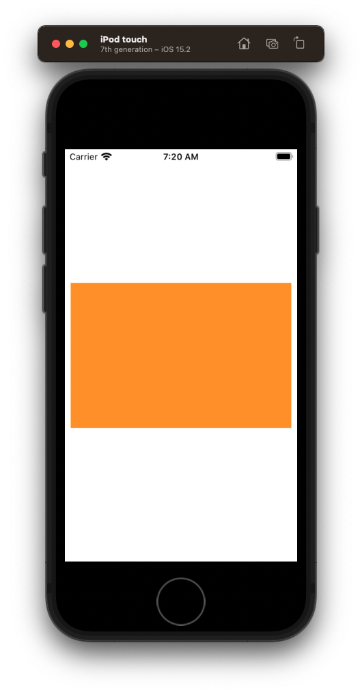
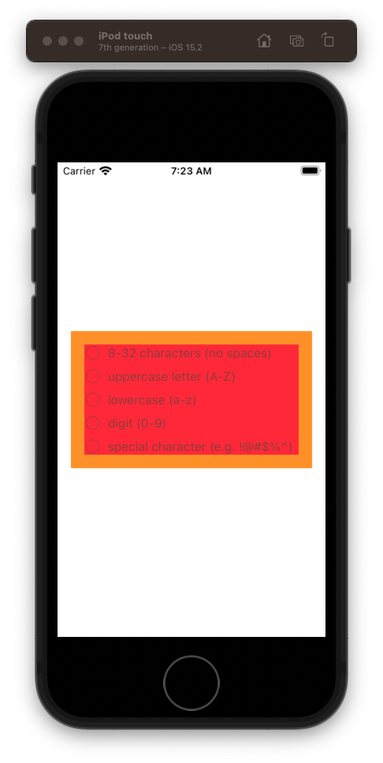
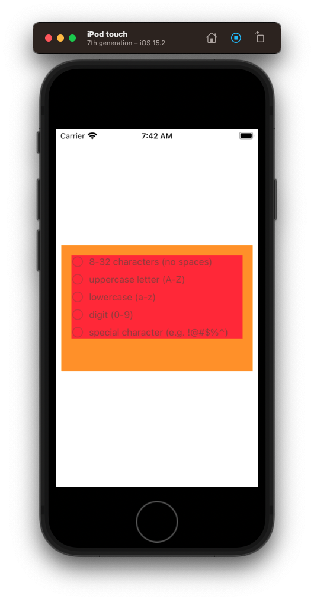
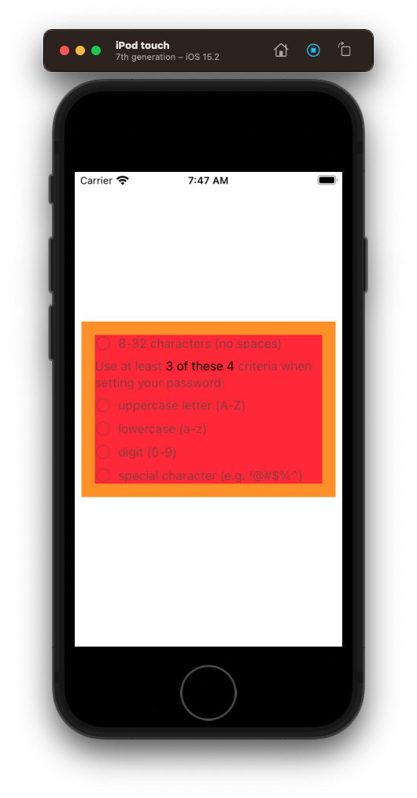
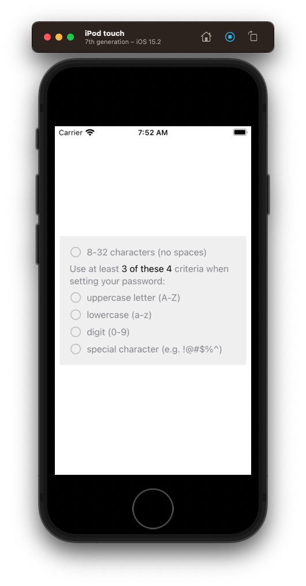
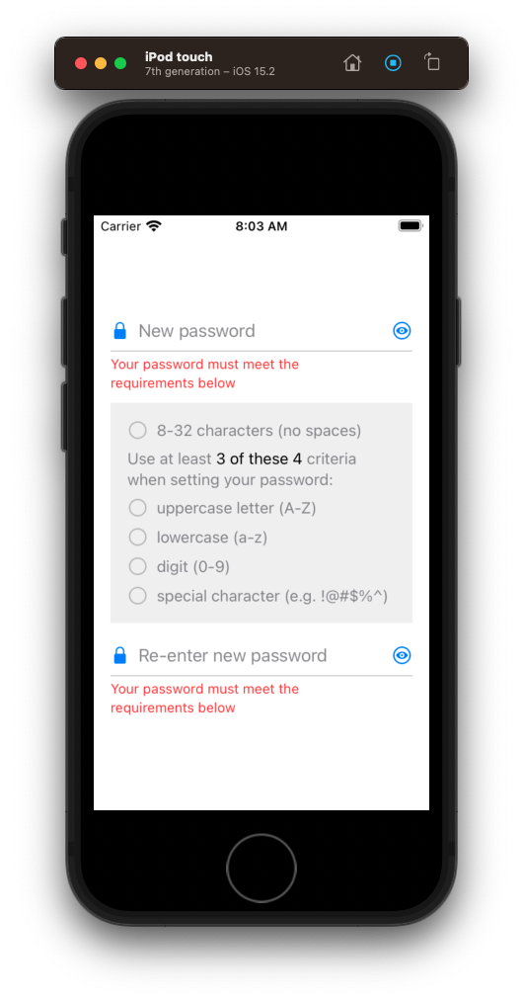
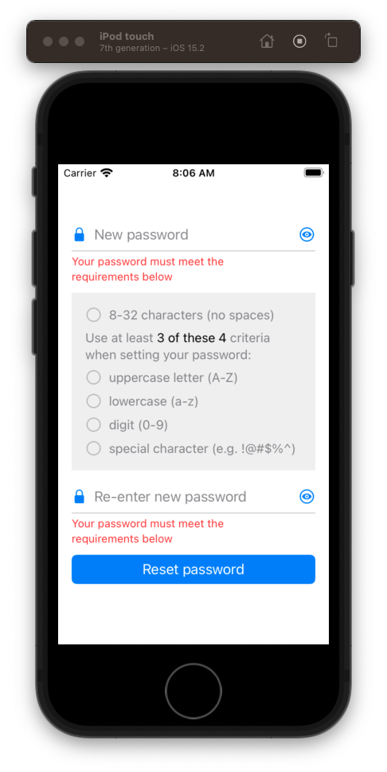

# PasswordStatusView

OK now that we've got our `PasswordCriteriaView`,
lets use that to continue building our `PasswordStatusView`.


## Create the PasswordStatusView

- Create `PasswordStatusView` file
- Stub out the view
- Make `backgroundColor = .systemOrange`

**PasswordStatusView**

```swift
import Foundation
import UIKit

class PasswordStatusView: UIView {
    
    override init(frame: CGRect) {
        super.init(frame: frame)
        
        style()
        layout()
    }
    
    required init?(coder: NSCoder) {
        fatalError("init(coder:) has not been implemented")
    }
    
    override var intrinsicContentSize: CGSize {
        return CGSize(width: 200, height: 200)
    }
}

extension PasswordStatusView {
    
    func style() {
        translatesAutoresizingMaskIntoConstraints = false
        backgroundColor = .systemOrange
    }
    
    func layout() {
        
    }
}
```

- Add to view controller

**ViewController**

```swift
let criteriaView = PasswordCriteriaView(text: "uppercase letter (A-Z)") // delete

let statusView = PasswordStatusView()

statusView.translatesAutoresizingMaskIntoConstraints = false

stackView.addArrangedSubview(statusView)
```



### Challenge 🕹 Add the stack view

Just like we did before, let's start by adding a stack view to our `PasswordStatusView`. 

- Define `let stackView = UIStackView()`
- Make axis `verticial`
- Give it a spacing of `8 pts`
- Make stack view `backgroundColor = .systemRed`
- Pin `top`, `leading`, `trailing`, `bottom` with system spacing `x2`


### Solution ✅

**PasswordStatusView**

```swift
let stackView = UIStackView()

stackView.translatesAutoresizingMaskIntoConstraints = false
stackView.axis = .vertical
stackView.spacing = 8
stackView.backgroundColor = .systemRed

addSubview(stackView)

// Stack layout
NSLayoutConstraint.activate([
    stackView.topAnchor.constraint(equalToSystemSpacingBelow: topAnchor, multiplier: 2),
    stackView.leadingAnchor.constraint(equalToSystemSpacingAfter: leadingAnchor, multiplier: 2),
    trailingAnchor.constraint(equalToSystemSpacingAfter: stackView.trailingAnchor, multiplier: 2),
    bottomAnchor.constraint(equalToSystemSpacingBelow: stackView.bottomAnchor, multiplier: 2)
])
```


## Adding the criteria

Next let's add our criteria. Look how easy this is with the stack view.

**PasswordStatusView**

```swift
let lengthCriteriaView = PasswordCriteriaView(text: "8-32 characters (no spaces)")
let uppercaseCriteriaView = PasswordCriteriaView(text: "uppercase letter (A-Z)")
let lowerCaseCriteriaView = PasswordCriteriaView(text: "lowercase (a-z)")
let digitCriteriaView = PasswordCriteriaView(text: "digit (0-9)")
let specialCharacterCriteriaView = PasswordCriteriaView(text: "special character (e.g. !@#$%^)")

lengthCriteriaView.translatesAutoresizingMaskIntoConstraints = false
uppercaseCriteriaView.translatesAutoresizingMaskIntoConstraints = false
lowerCaseCriteriaView.translatesAutoresizingMaskIntoConstraints = false
digitCriteriaView.translatesAutoresizingMaskIntoConstraints = false
specialCharacterCriteriaView.translatesAutoresizingMaskIntoConstraints = false

stackView.addArrangedSubview(lengthCriteriaView)
stackView.addArrangedSubview(uppercaseCriteriaView)
stackView.addArrangedSubview(lowerCaseCriteriaView)
stackView.addArrangedSubview(digitCriteriaView)
stackView.addArrangedSubview(specialCharacterCriteriaView)
```


### Discussion: Why are our circles still stretched and big?

What you are seeing here is one of the more interesting properties of the stack view.

Because our stack view is pinned to the bottom in our `PasswordStatusView` it still wants to stretch its contents to fill all the available space (even though we have set high CHCR on the `PasswordCriteriaView`.

There are a couple of things we could do here.

### Hard code the heights

One thing we could do is hard code the heights and take away the height ambiguity that way.

**PasswordStatusView**

```swift
// Hard coded heights
let height: CGFloat = 20
NSLayoutConstraint.activate([
    lengthCriteriaView.heightAnchor.constraint(equalToConstant: height),
    uppercaseCriteriaView.heightAnchor.constraint(equalToConstant: height),
    lowerCaseCriteriaView.heightAnchor.constraint(equalToConstant: height),
    digitCriteriaView.heightAnchor.constraint(equalToConstant: height),
    specialCharacterCriteriaView.heightAnchor.constraint(equalToConstant: height),
])
```



#### Adjust the intrinsic content size

We could try changing the intrinsic content size of our `PasswordStatusView` to take up less space.

**PasswordStatusView**

```swift
override var intrinsicContentSize: CGSize {
    return CGSize(width: 200, height: 160) // was 200
}
```


#### Not fully pin stack view to bottom

We could not pin the stack view to the bottom and let it sort of hang there with it's natural size.

**PasswordStatusView**

```swift
override var intrinsicContentSize: CGSize {
return CGSize(width: 200, height: 200)
}

// Stack layout
NSLayoutConstraint.activate([
    stackView.topAnchor.constraint(equalToSystemSpacingBelow: topAnchor, multiplier: 2),
    stackView.leadingAnchor.constraint(equalToSystemSpacingAfter: leadingAnchor, multiplier: 2),
    trailingAnchor.constraint(equalToSystemSpacingAfter: stackView.trailingAnchor, multiplier: 2),
//            bottomAnchor.constraint(equalToSystemSpacingBelow: stackView.bottomAnchor, multiplier: 2)
])
```



Or we could leave it the way it is. Because when we add our label, it is going fill in that extra available size, and we will find out `200pt` is about the right height for this view any ways.

> Stack views are one of these controls you just need to play with. Depending on the requirements of the design, the natural of the contents, and the view itself is sitting in, you sometimes just need to play.
> 
> That's what I did here. I just played with the stack view until I go the layout I wanted. And I encourage your to do the same when using it our your projects.

Let's leave our stack view pinning to the bottom. And get our label in there and see what things look like.

## Adding the label

We can add the label to our password view like this.

**PasswordStatusView**

```swift
let criteriaLabel = UILabel()

criteriaLabel.numberOfLines = 0
criteriaLabel.lineBreakMode = .byWordWrapping
criteriaLabel.attributedText = makeCriteriaMessage()

stackView.addArrangedSubview(criteriaLabel)

private func makeCriteriaMessage() -> NSAttributedString {
    var plainTextAttributes = [NSAttributedString.Key: AnyObject]()
    plainTextAttributes[.font] = UIFont.preferredFont(forTextStyle: .subheadline)
    plainTextAttributes[.foregroundColor] = UIColor.secondaryLabel
    
    var boldTextAttributes = [NSAttributedString.Key: AnyObject]()
    boldTextAttributes[.foregroundColor] = UIColor.label
    boldTextAttributes[.font] = UIFont.preferredFont(forTextStyle: .subheadline)

    let attrText = NSMutableAttributedString(string: "Use at least ", attributes: plainTextAttributes)
    attrText.append(NSAttributedString(string: "3 of these 4 ", attributes: boldTextAttributes))
    attrText.append(NSAttributedString(string: "criteria when setting your password:", attributes: plainTextAttributes))

    return attrText
}
```



Alright that looks pretty good.

## Final touches

Let's remove our hard coded views and give this status view a nice background color.

**PasswordStatusView**

```swift
backgroundColor = .tertiarySystemFill
stackView.backgroundColor = .systemRed // delete
```



And then let's round the corners by setting the corner radius on `PasswordStatusView` in our `ViewController`.

**ViewController**

```swift
statusView.layer.cornerRadius = 5
statusView.clipsToBounds = true
```

Subtle. But it is there.


And then let's add back our `newPasswordTextField` along with a `confirmPasswordTextField`.

**ViewController**

```swift
let confirmPasswordTextField = PasswordTextField(placeHolderText: "Re-enter new password")

confirmPasswordTextField.translatesAutoresizingMaskIntoConstraints = false

stackView.addArrangedSubview(newPasswordTextField)
stackView.addArrangedSubview(statusView)
stackView.addArrangedSubview(confirmPasswordTextField)

NSLayoutConstraint.activate([
    stackView.leadingAnchor.constraint(equalToSystemSpacingAfter: view.leadingAnchor, multiplier: 2),
    view.trailingAnchor.constraint(equalToSystemSpacingAfter: stackView.trailingAnchor, multiplier: 2),
    stackView.centerYAnchor.constraint(equalTo: view.centerYAnchor),
])
```



### Add button

The then finally add the reset button.

**ViewController**

```swift
let resetButton = UIButton(type: .system)

resetButton.translatesAutoresizingMaskIntoConstraints = false
resetButton.configuration = .filled()
resetButton.setTitle("Reset password", for: [])
// resetButton.addTarget(self, action: #selector(resetPasswordButtonTapped), for: .primaryActionTriggered)

stackView.addArrangedSubview(resetButton)
```



Tada! 🎉 View complete.

### Save your work 🕹

```
> git add .
> git commit -m "feat: add layout status view"
```